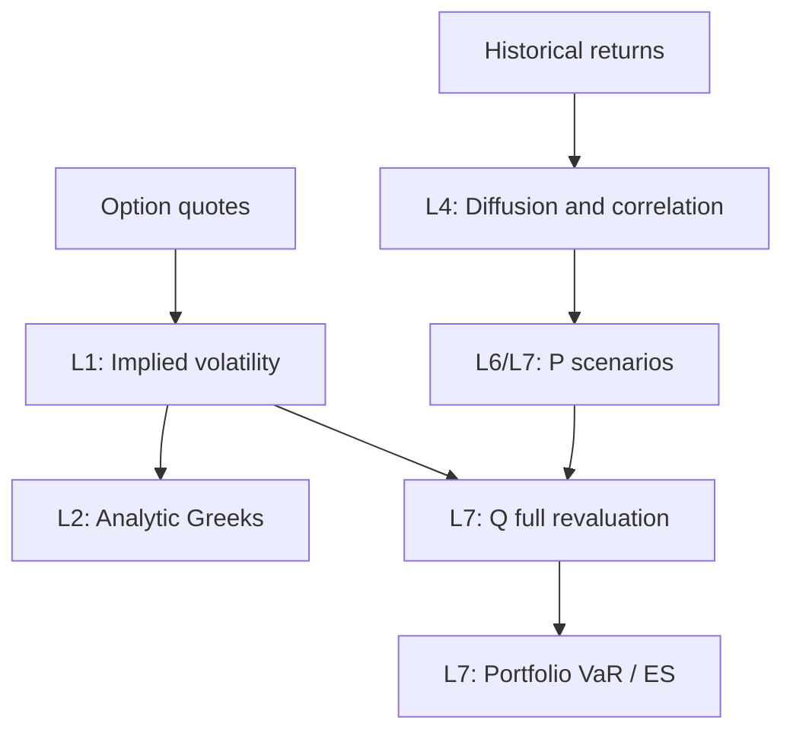

# FinMaths Synthetic Data Demo

面向结构化金融数学任务构建与 agent evaluation 的可重放合成金融衍生品项目。
项目从可控的金融模型生成结构化市场数据，将数据组织为需要查询、编程和数值计算的
agent task，并以 sandbox 运行合同和独立 verifier 支持受限执行与结果验证。

项目流程是 **synthetic market data → synthetic agent task → sandbox execution
与 independent verification**。金融任务覆盖路线从 BSM 定价、隐含波动率和 Greeks，
逐步延伸到风险参数校准、组合风险与 Monte Carlo VaR/ES。

**当前可运行主线是 `tdgbm_bsm` 下的解析 BSM、visible-price IV 和五个核心 Greeks。**
仓库已有 portable task packages、受限 reference replay、独立验证器与任务变异组件；
完整 L0–L8 curriculum 和 G0–G4 Greek families 是金融任务扩展路线，
并不表示所有层级已实现。

- [项目目标与流程](#项目目标与流程)
- [快速开始](#快速开始)
- [数学框架](#数学框架)
- [课程体系](#课程体系)
- [任务变异与语义合同](#任务变异与语义合同)
- [当前任务与交付形式](#当前任务与交付形式)
- [独立验证与执行边界](#独立验证与执行边界)
- [金融任务扩展方向](#金融任务扩展方向)
- [仓库导航](#仓库导航)

## 项目目标与流程

项目希望把金融数学中的明确模型、结构化输入和可计算结果转化为可批量构建、可定位错误的
agent tasks。Agent 需要理解数据关系、选择并实现任务指定的数值步骤、处理单位与输出
合同，并通过工具提交结果。

合成数据允许控制资产、产品、参数、数据接口与任务组合；固定配置、版本、seed、随机流和
数值约定后，同一市场快照可以确定性重放。任务的标准答案由 verifier 从实际公开输入独立
重算，因此报价经过输出舍入后，IV 任务也必须求解公开报价对应的逆问题。

| 环节 | 作用 | 当前实现 |
|:---|:---|:---|
| Market authoring | 在 `P` 下生成 underlying 状态，在声明的 `Q` 下生成 European option quotes | `authoring/`，包括可冻结的 DuckDB parent snapshot |
| Public export | 从 frozen parent 导出独立的公开数据，不复制 latent state 或 oracle | `export/` |
| Task construction | 绑定任务目标、方法、数据、单位、输出 schema 与工具接口 | `tasks/`、`task_space/`、BSM packaging |
| Sandbox execution | Agent 通过公开工具获取数据并提交；reference harness 按运行合同重放 | versioned runtime profiles、trusted adapters 与 reference replay |
| Independent verification | 受信任的 QuantLib 实现独立复算，检查 canonical output | `verifier/` 与 self-contained leaf verifier |

上述 Python 模块均位于 [`src/synthetic_derivatives/`](src/synthetic_derivatives/README.md)。
当前只有 `tdgbm_bsm` 具备完整的 authoring、solver、verifier、runtime 与 delivery 实现链路；
catalog 中的其他 model families 仍需各自实现。

## 快速开始

建议在 Linux/WSL 下使用 **Python 3.12.x** 和 `make`。项目依赖锁定在
[`requirements.lock`](requirements.lock)；authoring 和 trusted verifier 使用
`QuantLib==1.39`，数据库使用 `duckdb==1.5.5`。这些开发依赖不自动授予 Agent 使用权限。

### 1. 安装与检查公开快照

`make install` 使用 `python3` 创建仓库内的 `.venv`，请先确保 `python3` 指向 3.12。

```bash
git clone https://github.com/ruihuabunny/FinMaths-synthetic-data-demo.git
cd FinMaths-synthetic-data-demo
python3 --version
make install
make snapshot-summary
```

`snapshot-summary` 只读仓库中的 public snapshot。完整回归测试入口是：

```bash
make test
```

### 2. 生成 authoring 数据

```bash
make smoke
make append-day
```

默认数据库为 `/tmp/metals-liquid-tdgbm-q-v4.duckdb`；第一条命令生成 smoke snapshot，
第二条在同一数据库追加一天。可用 `DATABASE=/tmp/<new-name>.duckdb` 覆盖路径。
这一步生成 authoring 数据；portable task 由下面的 packaging 流程构建。

### 3. 构建并验证一个任务

```bash
.venv/bin/python scripts/package_bsm_greeks_task.py \
  --base-parent-config configs/generators/quantlib_bsm_metals_option_chain_smoke_v2.json \
  --output-root /tmp/bsm-greeks-packages \
  --build-status ACCEPTED
```

该入口从配置创建临时 private parent，构建包含公开输入、prompt、runtime contract、
submission schema、verifier 与 reference replay 的 source package，并进行验收。

### 4. 批量构建任务

```bash
.venv/bin/python scripts/run_bsm_greeks_batch.py \
  --run-root /tmp/bsm-greeks-batch-smoke \
  --dataset-copy /tmp/bsm-greeks-dataset-smoke \
  --task-count 2
```

完成后，run 目录包含 `packages/`、`dataset/` 和 `run_summary.json`；
`--dataset-copy` 指向额外导出的数据集副本。批量生成会跳过合同规定的不合格候选，
直到得到指定数量的 accepted tasks，或达到候选尝试上限。

### 5. 转为 portable delivery

上一步成功完成后，可以将这两个 source packages 转为独立的 combined IV+Greeks 交付：

```bash
.venv/bin/python scripts/package_bsm_greeks_delivery.py \
  --run-root /tmp/bsm-greeks-batch-smoke \
  --output-root /tmp/bsm-greeks-deliveries \
  --delivery-id local-combined-smoke-v1 \
  --expected-task-count 2
```

批量 run、dataset copy 与 delivery 请使用尚不存在的输出目录或新身份。
已发布的 delivery 不原地覆盖。6×4 single-metric suite 需要 24 个 accepted source tasks
以及相应 profile，完整参数见 [task packages 说明](task_packages/README.md)。
上述命令入口见 [scripts 说明](scripts/README.md)。

## 数学框架

### 历史动力学与定价模型

当前唯一实现的 model family 是 `tdgbm_bsm`，对应 task-space model 坐标 `M=0`：
在物理测度 $\mathbb P$ 下使用 deterministic time-inhomogeneous GBM 生成历史状态，
在风险中性测度 $\mathbb Q$ 下使用 European BSM 定价。Family identity 显式声明
drift-only/same-diffusion measure mapping。

对资产 $i$，历史动力学写作：

$$
\frac{dS_{i,t}}{S_{i,t}}
=\mu_i^P(t)\,dt+\sigma_i^P(t)\,dW_{i,t}^P,
\qquad
dW_{i,t}^P dW_{j,t}^P=\rho_{ij}\,dt.
$$

在给定报价时点的 constant-volatility BSM inverse problem 中：

$$
V_{\mathrm{BSM}}(S,K,T,r,q,\sigma_{\mathrm{imp}})
=V_{\mathrm{quote}}.
$$

这里需区分三个对象：

| 对象 | 来源 | 用途 |
|:---|:---|:---|
| Physical volatility $\sigma^P(t)$ | 历史动力学；未来 L4 任务中由收益数据估计 | 生成或校准 `P` 下的风险情景 |
| Pricing volatility $\sigma^Q$ | Authoring 中声明的定价模型及 P/Q mapping | 生成合成期权报价 |
| Implied volatility $\sigma_{\mathrm{imp}}$ | 从 Agent 实际可见的报价反解 | Market-implied Greeks 与指定的 BSM 重估 |

即使某个 authoring mapping 使部分参数数值相同，它们的语义仍不同；报价舍入后，
反解的 canonical IV 也不能直接复制隐藏的 authoring volatility。
定价使用 $r-q$ 作为风险中性漂移，不能以历史 physical drift 替代。

当前合同使用 USD money-market account 作为 numeraire，spot 为 ex-dividend price，
期限采用 Actual/365 Fixed，rate/dividend yield 使用连续复利年化约定。
具体 stochastic identity 见 [model-family config](configs/model_families/tdgbm_bsm_v1.json)
和 [solver 数学合同](src/synthetic_derivatives/solver/analytic_and_implied_greeks_iv/README.md)。

### 两条课程链路如何汇合

定价链路从 quote 求 IV，再计算 Greeks；风险链路从历史收益估计 diffusion/correlation，
再生成未来情景。L7 的 option portfolio full revaluation 将两者组合：



图中的 L4–L7 属于规划。基础 L7 使用 frozen per-contract IV，并明确期限滚降、到期
settlement、positions、contract multipliers 和 cash treatment。
Underlying dependence 作用于模型驱动；当前可生成相关 underlying 与 common-`Q` vanilla
pricing context，但这不等于已有 basket/spread joint-payoff solver 或风险校准任务。

## 课程体系

本节依据 [基础 curriculum](docs/curricula/synthetic_bsm_agent_task_complete_curriculum.md)
与 [扩展 Greeks curriculum](docs/curricula/synthetic_bsm_agent_task_more_greeks_complete_curriculum.md)。
完整输入、数值方法与验收约定以这两份文档为设计参考；当前可执行范围以代码、版本化
合同及 capability registry 为准。

### L0–L8：按能力依赖组织任务

| Level | 核心任务 | 测度 | 主要输入与输出 | 当前状态 |
|:---|:---|:---|:---|:---|
| L0 | Analytic BSM pricing | `Q` | 给定 spot、strike、期限、rate、dividend、pricing volatility，计算 European call/put price | 解析数值实现已有；不单独宣称已有 L0 portable suite |
| L1 | Analytic implied volatility | `Q` | 从可见报价反解 IV，遵守指定 bracket、迭代与异常状态合同 | Scalar IV 已实现；portable suite 含 `iv` target |
| L2 | Analytic market-implied Greeks | `Q` | 给定或反解 IV，计算指定 Greeks；后续扩展 chain、portfolio 与 hedging | 五个核心 unit Greeks、combined 与 single-metric packages 已实现；其余见下表 |
| L3 | MC pricing 与 MC Greeks | `Q` | 固定 draw/estimator/bump protocol，计算 MC price 与 sensitivities | 仅 `solver/mc/` scaffold；无可运行 estimator、variant 或 verifier |
| L4 | Diffusion/correlation calibration | `P` | 历史 log returns → diffusion node values、PSD correlation、integrated covariance | 规划；authoring 能生成这些动力学不代表 calibration task 已实现 |
| L5 | Delta-normal analytic VaR/ES | `P` | 暴露、预测期均值与协方差 → 线性近似下的 VaR/ES | 规划 |
| L6 | Underlying portfolio MC VaR/ES | `P` | 校准参数与 positions → 情景损失分布 → MC VaR/ES | 规划 |
| L7 | Option portfolio full-revaluation MC VaR/ES | `P → Q` | `P` 情景 + `Q` BSM 重估 → option/mixed portfolio 风险 | 规划 |
| L8 | 研究型扩展 | 按任务声明 | MC-IV、dynamic IV、delta-gamma/Taylor risk、高阶 MC estimators、conditional drift 等 | 研究路线 |

**这里的 L0–L8 是课程文档中的能力层级，不等于代码七维坐标中的 reasoning axis `L`。**
同层增加资产数、期权数或数据规模通常属于 mutation；新增建模假设或方法依赖才需要
单独定义能力层级。

风险课程遵循以下约定：

- 基础任务令 $\mu^P=0$，或直接提供 drift nodes；不要求从 65 日单路径恢复 drift。
- L4 给出 diffusion node dates，估计 node values，再由标准化 residual 估计并投影
  PSD correlation。验收需冻结估计方法，不把有限样本估计量与生成器真实参数混为一谈。
- L5 是 **delta-normal approximation**，不把它称为一般 option portfolio 的精确 VaR。
- L6 对 deterministic diffusion 的 integrated moments 按合同计算，再联合采样 log returns。
- L7 先生成 `P` 情景，再在各情景中做 `Q` 重估；不会把 risk simulation 的测度换成 `Q`。
- L8 中会改变假设的扩展需要独立合同，不能作为普通参数变异混入基础任务。

### G0–G4：Greeks 覆盖范围

扩展 curriculum 用独立的 `greek_family` 轴组织敏感度和应用。
它可以与 analytic、MC、chain、portfolio 任务组合，**目前仍是课程设计维度，
不是已加入七维 TaskSpec 坐标的第八轴**。

| Family | 内容 | 当前覆盖 |
|:---|:---|:---|
| G0：Core | Delta、Gamma、Vega、Theta、Rho、Dividend Rho | 前五项 unit Greeks 已实现；Dividend Rho 规划中 |
| G1：Cross/curvature | Vanna、Vomma、Charm、Speed、Zomma | 规划 |
| G2：Time decay / volatility curvature | Color、Veta、Ultima | 规划 |
| G3：Strike / dual | Dual Delta、Dual Gamma | 规划 |
| G4：Applications | Greek P&L decomposition、cross-Greek hedge、hedge 后 residual exposure | 规划；不新增 Greek 名称 |

设计中的输出轴共 **17 项：IV + 16 个 Greeks**。`volga` 是 `vomma` 的别名，不重复计数。
这些组按用途与课程梯度划分，并不严格对应偏导阶数。

高阶扩展必须明确求导变量、保持不变的参数、calendar time 与 time-to-maturity 的符号，
以及每一维的单位缩放。例如 Vega 按每 1 vol point 输出时缩放 $10^{-2}$，
Vomma 的两个 volatility derivative 维度对应 $10^{-4}$；组合聚合还需 positions、
contract multipliers 与必要的 FX conversion。详细定义见
[扩展 curriculum 的 Greek contracts](docs/curricula/synthetic_bsm_agent_task_more_greeks_complete_curriculum.md#6-l2analytic-market-implied-greeks)。

### Isolated 与 composed tasks

课程依赖不要求每道任务都从定价一路完成到组合风险。

| 形式 | 设计方式 | 示例与用途 |
|:---|:---|:---|
| Isolated | 直接给出上游中间量，只考察一个主能力 | 给定 IV 算 Greeks；给定 diffusion/correlation 算 MC VaR/ES；便于定位短板 |
| Composed | 要求完成多个依赖步骤，并检查关键中间结果 | 当前 quote → IV → Greeks；未来 calibration → scenarios → revaluation → VaR/ES |

Single-metric task 只要求一个输出指标，但可能仍需先计算 IV，所以不自动等同于
“完全隔离上游依赖”的任务。未来 composed 风险任务应分别检查 calibration、simulation、
pricing 和 tail aggregation 产物，帮助定位失败环节。

## 任务变异与语义合同

### 横向 mutation

课程层级描述“需要什么能力”，mutation 描述“同一能力下如何改变任务”。
下表是目标设计空间；其中 MC、risk、hedging 等维度需相应任务实现后才可使用。

| 维度 | 可改变的内容 |
|:---|:---|
| Instrument 与 scale | Call/put、资产数、期权数、option-chain 长度、组合规模 |
| Moneyness 与 maturity | ITM/ATM/OTM、短期限/长期限、strike/expiry 分布 |
| Market inputs | Rates、dividends、quote noise |
| Physical dynamics 与 dependence | Constant/多节点 diffusion、identity/block/dense PSD correlation |
| Portfolio 与 risk setup | Long/short、multipliers、horizon、confidence level、scenario count |
| Numerical method | Analytic、plain MC、antithetic、pathwise 等有独立 method contract 的方法 |
| Greek target 与 units | Greek family、unit/portfolio output、per vol point/per bp/per day |
| Data 与 tool interface | 数据规模、missing/invalid rows、static query 或 read-only SQL query |

仓库已实现 deterministic mutation engine 和独立的 family-aware 路径。
后者使用 [`tdgbm_bsm_deterministic_v1.json`](configs/mutations/tdgbm_bsm_deterministic_v1.json)，
支持单轴升降、semantic counterfactual 和受限多轴变异；每个 child 都必须通过设计兼容性与
精确 executable-capability 检查。普通 mutation 保持 `model_family_id` 与 `M` 不变；
换模型需要重新 author 一个具备完整实现证据的任务。

### 设计坐标、语义身份与可执行能力

七维 design catalog 使用以下坐标：

| 坐标 | 含义 |
|:---|:---|
| `L` | Reasoning |
| `P` | Product；与概率测度 $\mathbb P$ 无关 |
| `M` | Model |
| `A` | Numerical method |
| `D` | Data/tool interaction |
| `R` | Risk/output |
| `F` | Arbitrage-finding 分类；当前 BSM 主线使用 `F0` |

Semantic TaskSpec v3 另外区分 `model_family_id`、`task_family_id`、`task_kind_id`、
`solver_interface_id`、`method_id` 和 `output_contract_id`，并绑定 frozen snapshot。
改变算法、Agent 接口、输出合同或数据身份，需要相应的新标识或 child lineage。

Design catalog 只判断组合在结构上是否成立；[executable capability registry](configs/task_space/executable_capabilities_v1.json)
才记录精确语义组合的实现状态。`library_implemented` 表示库级能力，
`portable_verified` 表示相应能力已通过可移植任务交付验证。
Agent 实际可用的 imports、工具、挂载目录和预算继续由具体 runtime profile 决定。

TaskSpec 的 `v3` 与 DuckDB-query protocol 的 `v3` 是不同的版本体系。
现有冻结任务通过 adapter 映射到新语义身份，不重写旧 package 的 ID、manifest 或 digest。
详见 [task space](src/synthetic_derivatives/task_space/README.md) 与
[model families](src/synthetic_derivatives/model_families/README.md)。

## 当前任务与交付形式

### 当前六个 single-metric targets

Agent 读取公开 spot/pricing context 与 option bid/ask quotes，从报价构造 midpoint，
按指定 BSM inverse problem 求 IV，再计算目标指标。

| 当前 target ID | 数值含义与输出单位 |
|:---|:---|
| `iv` | 年化 implied volatility，decimal 表示，例如 20% 写作 0.20 |
| `delta` | 每 1 spot-price unit 的一阶敏感度 |
| `gamma` | 每 1 squared spot-price unit 的二阶敏感度 |
| `vega_1volpt` | Volatility 上升 1 percentage point 的敏感度 |
| `theta_1calendar_day` | Valuation time 前进 1 calendar day、expiry 固定时的时间衰减单位 |
| `rho_1pct` | 连续复利年化 rate 上升 1 percentage point 的敏感度 |

Vega/Theta/Rho 是按合同缩放后的导数，不是用一次有限幅度 bump 得到的实际价格差。
Greeks 在未舍入的 IV root 上计算。当前任务输出的是 unit-option 指标，
不包含尚未实现的 position-weighted portfolio Greeks。

Combined v2 的典型 task 包含 8 个 underlyings 与 160 个 option rows。Agent 各调用一次
`query_greeks_underlying_market_v2` 和 `query_greeks_option_quotes_v2`，再通过
`submit_greeks_submission_v2` 一次提交完整结果。
Prompt 提供任务、输入关系、方法与单位合同，不提供闭式 BSM/Greek 公式或参考答案。

### 已发布的 portable suites

| Delivery | 内容 | 数据/接口关系 |
|:---|:---|:---|
| [Combined v2，100 tasks](task_packages/deliveries/bsm_market_implied_greeks_v1/20260813_prompt_v2_100) | 每题联合输出 IV 与五个 Greeks | 一个 `unsplit_shared_parent_snapshot` evaluation group |
| [Single-metric static v2，6×4 tasks](task_packages/deliveries/bsm_market_implied_metric_suite_v1/20260819_metric_6x4_static_v2_modular) | 六个 targets，各四个任务 | 从 24 个不同 accepted source databases 分配，每个 source 使用一次 |
| [Single-metric DuckDB query v3，6×4 tasks](task_packages/deliveries/bsm_market_implied_metric_suite_v1/20260819_metric_6x4_db_query_v3_modular) | 同样六个 targets，改用受限 read-only SQL 查询 | 与对应 static suite 复用相同 source markets，属于接口变体 |

两套 single-metric deliveries 使用 modular self-contained verifier；对应的
`*_rerun` monolithic baselines 保持冻结。Static/query 两种交付复用的数据不应重复计算为
独立市场样本，100 个 shared-parent tasks 也不代表 100 个独立市场环境。

| 接口 | 数据获取 | 提交约定 |
|:---|:---|:---|
| Static query v2 | Trusted tool 返回 canonical JSON rows | 遵守冻结的 row order |
| DuckDB query v3 | `query_public_duckdb_v3` 查询 host-only database | `submit_greeks_submission_v3` 一次提交；按精确 `row_id` 集合对齐，输入行顺序无语义 |

### Package 与 Agent 可见文件

Source package 区分 `public/`、`verifier/`、`reference/`、`authoring_private/`，
并构建彼此隔离的 release views。Portable task 将运行所需资产按可见性分开：

| 资产 | 内容 | Evaluation Agent 是否可直接读取 |
|:---|:---|:---|
| `evaluation_view/manifest.json` | 公开 view manifest | 是 |
| `evaluation_view/public/prompt.md` | 完整任务说明 | 是 |
| `evaluation_view/public/runtime_contract.json` | 能力与工具预算 | 是 |
| `evaluation_view/public/submission.schema.json` | 输出语法 | 是 |
| `task.duckdb`、`trusted_tools/` | Host-side 数据和工具绑定；static 版本还含 query payloads | 否，经声明的工具访问 |
| `verifier/` | 独立复算与验收代码 | 否 |
| Source `reference/`、`authoring_private/` | 参考轨迹、答案与生成 provenance | 否 |

`public/` 的目录名不表示整个 source package 都能挂载给 Agent；实际 evaluation filesystem
只有上表的四个公开文件。开发验证所用的 reference trajectories 与评测输入分别管理。
详见 [task packages](task_packages/README.md)。

## 独立验证与执行边界

### 当前 BSM hard verifier

当前 combined/metric tasks 的 canonical truth 从 solver-visible public inputs 独立重算：

1. 以 Decimal 语义重建 bid/ask midpoint，再转换一次为 binary64。
2. 在 `[1e-6, 5.0]` 上完成恰好 **80 次 bisection updates**，不用提前停止。
3. 使用未舍入 root，通过 `QuantLib.AnalyticEuropeanEngine` 计算 unit Greeks。
4. 按合同缩放单位，最终以 **8 位小数、`ROUND_HALF_EVEN`** 生成 canonical representation。
5. 检查 schema、行身份及协议要求，并对规范化后的 decimal strings 做 **exact equality**。

Exact comparison 指冻结表示上的一致，不声称 binary64 计算等于无限精度数学值。
Publication gate 还要求独立的标准库 reference 与 QuantLib 结果 canonical 一致，
并排除距 half-quantum rounding boundary 小于 `1e-11` 的候选。

在 source package 根目录或 authoring view 中，使用具有 verifier 锁定依赖的 Python
验证实际提交文件：

```bash
BSM_GREEKS_SUBMISSION=/absolute/path/submission.json \
  python -B -m pytest -q verifier
```

未来 MC 任务若继续使用 exact verification，需要固定 PRNG、draw shape/order、path count、
antithetic/CRN、bump stencil、矩阵分解、浮点 reduction、quantile/ES 规则与序列化。
**仅固定 seed 不足以定义同一个 MC verifier target。**

### 独立复算与运行时隔离

| Boundary | 职责 |
|:---|:---|
| Authoring | 可使用私有配置与 QuantLib；生成、检查并冻结 parent |
| Public export | 只读 frozen parent，生成独立 public child |
| Agent Solver | 使用冻结合同允许的 Python 标准库和 trusted tools |
| Trusted verifier | 使用 pinned QuantLib/DuckDB，从公开输入独立重算 |

Solver 与 verifier 只共享输入、单位、method identity、canonicalization 和 schema 合同，
不共享定价、求根或 Greek 数值实现。检查输出正确性由 verifier 负责；工具、依赖和访问
权限由 runtime/harness 负责。

当前 reference harness 以独立进程执行受限 source，并管理 import/builtin policy、
工具调用预算、CPU/memory limits 与 timeout。接入实际 Agent runner 时，还需在 OS/container
层落实网络、filesystem/mount 和 process 隔离。对应约定见
[solver runtime](environments/solver/README.md)；Agent 没有 QuantLib、raw DuckDB connection、
动态安装或网络权限。

## 金融任务扩展方向

| 阶段 | 目标 | 与当前实现的关系 |
|:---|:---|:---|
| Release A1 | L0/L1/L2-G0 与基础 MC pricing/Greeks | 当前已有 analytic/IV/五个核心 Greeks；MC 部分待实现 |
| Release A2 | G1–G3 higher-order analytic Greeks | 在明确导数和单位合同后扩展 target、solver、verifier |
| Release A3 | G4 P&L/hedging 与 higher-order MC Greeks | 增加组合与 estimator/stencil 合同 |
| Release B | L4 diffusion/correlation calibration | 新增指定估计程序、PSD projection 与中间量验证 |
| Release C | L5–L7 analytic/MC VaR/ES | 连接 `P` 风险情景与 `Q` 定价，冻结 tail/settlement conventions |
| Release D | L8 research mutations | 为改变假设的新方法建立独立任务 |

Heston、local-vol 等 model families、basket/spread joint payoffs 与 F2A arbitrage 尚未实现。
目录或 catalog 条目存在，不会自动启用这些能力。课程中示意的 `task_config.yaml`
与 future task-pack layout 也不代表当前 parser 已支持；可运行示例使用本 README 中的
现有 JSON config 和脚本。

## 仓库导航

| 想做什么 | 从这里开始 |
|:---|:---|
| 理解整体架构和模块状态 | [`src/synthetic_derivatives/README.md`](src/synthetic_derivatives/README.md) |
| 阅读完整能力梯度 | [基础 curriculum](docs/curricula/synthetic_bsm_agent_task_complete_curriculum.md) |
| 阅读高阶 Greeks 与组合应用设计 | [扩展 Greeks curriculum](docs/curricula/synthetic_bsm_agent_task_more_greeks_complete_curriculum.md) |
| 修改 market/snapshot generator | [authoring](src/synthetic_derivatives/authoring/README.md)、[templates](authoring/templates/README.md) |
| 理解 public DuckDB export | [export](src/synthetic_derivatives/export/README.md) |
| 理解 model identity 与 capability | [model families](src/synthetic_derivatives/model_families/README.md)、[TaskSpec](src/synthetic_derivatives/task_space/README.md) |
| 修改任务变异 | [mutation](src/synthetic_derivatives/mutation/README.md) |
| 修改 analytic BSM/IV/Greeks | [solver package](src/synthetic_derivatives/solver/analytic_and_implied_greeks_iv/README.md) |
| 理解 package builder 与 modular verifier | [packaging](src/synthetic_derivatives/packaging_analytic_and_implied_greeks_iv/README.md) |
| 检查运行能力与依赖 | [environments](environments/README.md) |
| 使用 portable deliveries | [task packages](task_packages/README.md) |
| 查询 public snapshot | [SQL query examples](snapshots/public/sql_query/README.md) |
| 运行或扩展测试 | [tests](tests/README.md) |
| 阅读 architecture、plans 与 reports | [docs index](docs/README.md) |

根 README 负责项目入口与课程概览，具体实现细节保留在模块文档。
当前行为以代码、versioned config/schema、frozen manifest 和通过的 tests 为准；
`docs/plans/`、`docs/curricula/` 与历史 handoff/report 记录设计目标或迁移历史，
不能单独证明功能已经实现。已接受的 source packages、portable deliveries、public snapshots
与其身份保持冻结；新实现通过新的版本化合同和制品发布。

## License

Copyright 2026 Ruihua Luo.

本仓库中的原创代码及随附文档采用 [Apache License 2.0](LICENSE) 授权。
第三方依赖及第三方材料遵循各自的许可证。
