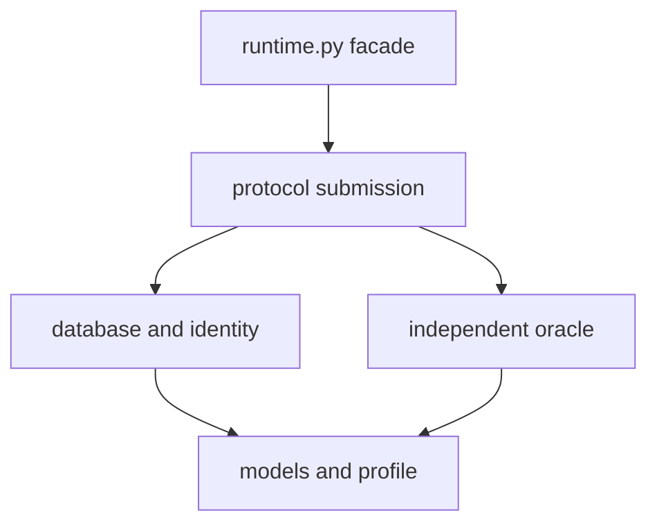

# BSM Metric Leaf Verifier Runtime Refactor Plan

## Status

- **Type:** completed refactor plan
- **Scope:** BSM market-implied metric verifier source templates, renderer, packaging integration, and tests
- **Current golden baseline:** immutable `20260819_*_rerun` deliveries
- **Modular deliveries:** `20260819_metric_6x4_static_v2_modular` and `20260819_metric_6x4_db_query_v3_modular`
- **Important:** the accepted `20260819` deliveries are frozen generated artifacts. Do not edit them in place.
- **Implementation status (2026-08-19):** Phases 0–7 are complete. The immutable machine-readable baseline is [`../../tests/fixtures/bsm_metric_leaf_verifier_20260819_baseline.json`](../../tests/fixtures/bsm_metric_leaf_verifier_20260819_baseline.json), with Phase 0 acceptance in [`../../tests/packaging_analytic_and_implied_greeks_iv/test_metric_leaf_verifier_golden_baseline.py`](../../tests/packaging_analytic_and_implied_greeks_iv/test_metric_leaf_verifier_golden_baseline.py).
- **Phase 1 evidence:** shared source-only [`models.py`](../../src/synthetic_derivatives/packaging_analytic_and_implied_greeks_iv/metric_leaf_verifier_runtime/models.py), [`database.py`](../../src/synthetic_derivatives/packaging_analytic_and_implied_greeks_iv/metric_leaf_verifier_runtime/database.py), and [`oracle.py`](../../src/synthetic_derivatives/packaging_analytic_and_implied_greeks_iv/metric_leaf_verifier_runtime/oracle.py) now pass exact old/new parsed-record, checksum, oracle-output, exception, and dependency-boundary comparisons over every frozen assignment in [`test_metric_leaf_verifier_shared_modules.py`](../../tests/packaging_analytic_and_implied_greeks_iv/test_metric_leaf_verifier_shared_modules.py). Phase 1 intentionally left production rendering on the frozen monolithic sources.
- **Phase 2 evidence:** typed [`profiles.py`](../../src/synthetic_derivatives/packaging_analytic_and_implied_greeks_iv/metric_leaf_verifier_runtime/profiles.py) and explicit [`submission_static_v2.py`](../../src/synthetic_derivatives/packaging_analytic_and_implied_greeks_iv/metric_leaf_verifier_runtime/submission_static_v2.py) / [`submission_duckdb_v3.py`](../../src/synthetic_derivatives/packaging_analytic_and_implied_greeks_iv/metric_leaf_verifier_runtime/submission_duckdb_v3.py) preserve the two frozen protocol contracts across all 48 assignments. [`test_metric_leaf_verifier_protocol_modules.py`](../../tests/packaging_analytic_and_implied_greeks_iv/test_metric_leaf_verifier_protocol_modules.py) proves profile/config identity, ordered static-v2 behavior, unordered v3 behavior, exact rejection outcomes, fail-closed profile validation, single-parser selection, and the absence of shadowed definitions or dynamic execution. Phase 2 intentionally left production rendering unchanged.
- **Phase 3 evidence:** source-only [`renderer.py`](../../src/synthetic_derivatives/packaging_analytic_and_implied_greeks_iv/metric_leaf_verifier_runtime/renderer.py) deterministically produces the proposed 15-file facade plus private `_runtime/` layout with one frozen profile and one selected submission parser. [`test_metric_leaf_verifier_renderer.py`](../../tests/packaging_analytic_and_implied_greeks_iv/test_metric_leaf_verifier_renderer.py) proves byte-identical rerenders, exact six-metric behavior for both protocols, recursive Python-module leakage and AST checks, size limits, fail-closed writes, relocation, and execution under `python -I` without a repository source path. Phase 3 intentionally left production integration for Phase 4.
- **Phase 4 evidence:** [`metric_verifier.py`](../../src/synthetic_derivatives/packaging_analytic_and_implied_greeks_iv/metric_verifier.py) now delegates both protocol renders and repository-side verification to the modular package, while [`portable_metric_suite.py`](../../src/synthetic_derivatives/packaging_analytic_and_implied_greeks_iv/portable_metric_suite.py) consumes the renderer-owned 15-path inventory for materialization, exact-tree checks, artifact digests, and visibility maps. [`test_portable_metric_suite.py`](../../tests/packaging_analytic_and_implied_greeks_iv/test_portable_metric_suite.py) and [`test_portable_metric_suite_v3.py`](../../tests/packaging_analytic_and_implied_greeks_iv/test_portable_metric_suite_v3.py) prove exact on-disk renders, complete nested bindings, unchanged `verifier_only` classification, nested-module tamper rejection, and rejection of an extra unbound verifier file in newly built suites. Accepted `20260819` deliveries remain untouched.
- **Phase 5 evidence:** [`test_metric_leaf_verifier_behavioral_equivalence.py`](../../tests/packaging_analytic_and_implied_greeks_iv/test_metric_leaf_verifier_behavioral_equivalence.py) imports production-rendered modular bundles beside copied frozen runtimes and compares all 48 assignments. It requires exact parsed records, logical checksums, expected submissions, real valid-submission verification, and validator/verifier outcomes for malformed, missing, extra, duplicated, reordered, non-canonical, NaN, infinity, boolean, wrong-identity, and last-decimal cases. Full exception types, messages, and causes are compared, which is stricter than the stable-prefix gate; static-v2 ordered and v3 unordered behavior are asserted independently, and rendered DuckDB/QuantLib pin failures remain fail-closed. No tolerance or artifact mutation is used.
- **Phase 6 evidence:** the two new modular deliveries reuse the accepted source-run summary digest `933e1eff8c1b890ddfb7b006d05e00a12494f9424b2c07cc5b41b060e399fb51` and allocation ID `20260819_metric_6x4_v1`. [`bsm_metric_leaf_verifier_20260819_modular_deliveries.json`](../../tests/fixtures/bsm_metric_leaf_verifier_20260819_modular_deliveries.json) freezes their identities, while [`test_metric_leaf_verifier_modular_delivery.py`](../../tests/packaging_analytic_and_implied_greeks_iv/test_metric_leaf_verifier_modular_delivery.py) verifies both complete suites and all 48 old/new leaf pairs. Public databases, logical checksums, assignments, oracle configs, and exact answers are unchanged. The full path audit is [`../../task_packages/reports/bsm_metric_leaf_verifier_modular_runtime_migration.md`](../../task_packages/reports/bsm_metric_leaf_verifier_modular_runtime_migration.md).
- **Phase 7 evidence:** the repository-side `bsm_market_metric_verifier_runtime.py` monolith and `bsm_market_metric_verifier_runtime_v3.py` suffix/dynamic-execution assembly are deleted. Production and tests use the explicit modular package; historical runtime copies remain only inside immutable accepted deliveries. The self-contained-leaf rationale is recorded in [`../../src/synthetic_derivatives/packaging_analytic_and_implied_greeks_iv/metric_leaf_verifier_runtime/README.md`](../../src/synthetic_derivatives/packaging_analytic_and_implied_greeks_iv/metric_leaf_verifier_runtime/README.md).
- **Final validation:** 378 focused leaf-refactor tests, 650 packaging tests, and all 978 repository tests pass with the repository-local pinned environment.
- **Measured baseline correction:** the frozen static-v2 and v3 runtimes contain 949 and 1,105 lines respectively (35,602 and 41,607 bytes). The earlier 950/1,106 figures below were approximate; the v3 file still consists of the complete static-v2 bytes followed by its suffix.

## Executive summary

The verifier runtime has been refactored, but the refactor target was **not** the copied `runtime.py` files inside the existing `20260819_*_rerun` deliveries. Those files are generated, self-contained leaf artifacts and remain immutable golden baselines.

The refactor was implemented in the source templates and renderer under:

```text
src/synthetic_derivatives/packaging_analytic_and_implied_greeks_iv/
```

The pre-refactor design had accumulated too many responsibilities in one generated module:

- dependency pin validation;
- file hashing and JSON loading;
- task database schema/version validation;
- public connection validation;
- logical checksum calculation;
- input parsing and domain validation;
- QuantLib-based independent oracle computation;
- implied-volatility root finding;
- canonical decimal formatting;
- static-v2 submission parsing and verification;
- DuckDB-query-v3 submission parsing and verification;
- metric/schema/protocol identity declarations.

More importantly, the old v3 implementation was assembled by appending a suffix to the complete v2 source and then redefining globals and functions. That created late-binding and shadowing risks which made protocol changes unnecessarily fragile.

The proposed result is a small stable `runtime.py` facade plus a private, self-contained `_runtime/` package in each generated verifier bundle. Static v2 and DuckDB-query v3 should use explicit protocol-specific submission modules, while sharing database, input-model, oracle, and canonicalization code. The bundle remains portable and does not import repository code at evaluation time.

## Evidence from the current implementation

The representative `20260819` verifier runtimes have the following shape:

| Protocol | Representative generated file | Approximate size | Lines |
|---|---|---:|---:|
| static v2 | `20260819_metric_6x4_static_v2_rerun/.../verifier/runtime.py` | 35.6 KB | 950 |
| DuckDB-query v3 | `20260819_metric_6x4_db_query_v3_rerun/.../verifier/runtime.py` | 41.6 KB | 1,106 |

The first 950 lines of the v3 runtime are byte-for-byte identical to the static-v2 runtime. The remaining v3 suffix then reassigns or redefines:

- `_DATABASE_SCHEMA_VERSION`;
- `_TASK_VERSION`;
- `_METRIC_SPECS`;
- `_METRIC_SPEC_BY_TARGET`;
- `validate_market_metric_submission_contract`;
- `verify_market_metric_submission`.

It also adds `_parse_submission_v3`.

Before Phase 7, `bsm_market_metric_verifier_runtime_v3.py` built a leaf runtime from the entire v2 runtime plus a raw v3 suffix and loaded it through dynamic `compile`/`exec` behavior. This had four concrete drawbacks:

1. **Function shadowing:** the active verifier depends on the last definition in one generated source file.
2. **Late global binding:** functions inherited from the v2 prefix may observe globals reassigned by the v3 suffix.
3. **Difficult review:** protocol-specific behavior is not isolated at a module boundary.
4. **Weak structural tests:** tests can validate behavior without detecting duplicate definitions or accidental v2/v3 coupling.

The repeated runtime files across task leaves are not themselves a defect. Each verifier must remain self-contained and portable. The defect is that the source renderer produces the repeated bundle from a monolithic and shadowed implementation.

## Goals

1. Make the verifier implementation reviewable by separating stable responsibilities.
2. Replace source concatenation, dynamic execution, and function redefinition with explicit modules.
3. Preserve exact verifier behavior, including error behavior and canonical output.
4. Keep each generated verifier bundle self-contained and relocatable.
5. Preserve the public `verifier.runtime` import surface used by current verifier tests.
6. Make static v2 and DuckDB-query v3 protocol differences explicit.
7. Retain independent oracle computation and the existing Solver/verifier trust boundary.
8. Give packaging code one authoritative verifier-file inventory.
9. Use the frozen `20260819` deliveries as behavioral and artifact baselines without modifying them.

## Non-goals

- Do not hand-edit any file under an accepted `task_packages/deliveries/.../20260819_*` tree.
- Do not regenerate market data, task inputs, public databases, or reference answers as part of this refactor.
- Do not change numerical algorithms, tolerances, rounding, units, or dependency pins.
- Do not unify unrelated model families behind a speculative generic verifier framework.
- Do not allow generated verifier modules to import `synthetic_derivatives` or other repository packages.
- Do not change the public task protocol from static v2 to DuckDB-query v3, or vice versa.
- Do not mix the host integration contract for `query_public_duckdb_v3` into the numerical verifier refactor; document and test that contract separately.

## Invariants that must not change

### Packaging and trust boundaries

- Every task leaf must carry everything required to run its hidden verifier.
- Generated verifier code must work in an isolated environment with no repository source on `PYTHONPATH`.
- The verifier must independently compute truth and must not import Solver or reference numerical implementations.
- Public task files and trusted-only verifier files must retain their current visibility classifications.
- Existing accepted delivery IDs and manifests remain immutable.
- Any newly materialized delivery receives a new delivery identity.

### Database and identity semantics

- Preserve the exact accepted database schema version for each protocol.
- Preserve table/column/type/nullability checks and unexpected-object rejection.
- Preserve public connection validation.
- Preserve logical checksum semantics, ordering, and canonical serialization.
- Preserve file-digest behavior where it is part of the current contract.
- Preserve the separation between the static-v2 and DuckDB-query-v3 task versions.

### Numerical oracle semantics

- `QuantLib==1.39` remains pinned unless a separate approved change updates it.
- `duckdb==1.5.5` remains pinned unless a separate approved change updates it.
- Use the USD money-market calendar and `Actual365Fixed` exactly as today.
- Convert decimal quote midpoints to binary64 exactly once at the current boundary.
- Preserve the implied-volatility bracket `[1e-6, 5]`.
- Perform exactly 80 bisection iterations.
- Compute Greeks at the unrounded implied-volatility root.
- Preserve all metric-unit scaling.
- Quantize output to eight decimal places with `ROUND_HALF_EVEN`.
- Compare canonical results exactly; do not introduce numerical tolerances.

### Submission semantics

- Static v2 remains ordered and retains its exact shape, key, row-count, and error behavior.
- DuckDB-query v3 remains unordered where currently specified and retains its exact identity/key rules.
- The six-metric whitelist remains protocol-specific and deterministic.
- No verifier bundle should contain both active protocol parsers with runtime selection logic. The renderer should select one submission module when building the bundle.

## Implemented target architecture

### Repository-side source modules

Create a BSM-specific source package:

```text
src/synthetic_derivatives/
└── packaging_analytic_and_implied_greeks_iv/
    └── metric_leaf_verifier_runtime/
        ├── __init__.py
        ├── models.py
        ├── database.py
        ├── oracle.py
        ├── submission_static_v2.py
        ├── submission_duckdb_v3.py
        ├── profiles.py
        └── renderer.py
```

Suggested responsibilities:

| Module | Responsibility |
|---|---|
| `models.py` | Input data types, binary64/date parsing, quote conversion, domain validation |
| `database.py` | Dependency checks, schema validation, loaders, public-connection validation, digests and logical checksum |
| `oracle.py` | QuantLib setup, pricing, IV bisection, Greek calculation, scaling and canonical decimal output |
| `submission_static_v2.py` | Ordered static-v2 submission contract and verification orchestration |
| `submission_duckdb_v3.py` | Unordered v3 submission contract, identity validation and verification orchestration |
| `profiles.py` | Typed source-side descriptions of task version, schema version and six allowed metrics |
| `renderer.py` | Deterministic construction of a self-contained leaf verifier bundle |

These modules are authoring sources. The generated leaf must not import them.

### Generated leaf layout

Render each new verifier as a small facade plus private modules:

```text
verifier/
├── README.md
├── __init__.py
├── conftest.py
├── oracle_config.json
├── requirements.lock
├── runtime.py
├── _runtime/
│   ├── __init__.py
│   ├── profile.py
│   ├── models.py
│   ├── database.py
│   ├── oracle.py
│   └── submission.py
├── test_contract.py
├── test_data_identity.py
└── test_semantics.py
```

`profile.py` is deterministically rendered from the selected source-side profile. `submission.py` is rendered from either `submission_static_v2.py` or `submission_duckdb_v3.py`; it is not a dispatcher containing both protocols.

`runtime.py` remains the compatibility facade for verifier tests and should re-export the current public API:

```python
BSMMarketMetricInput
bsm_metric_logical_checksum
digest_file
expected_market_metric_submission
load_bsm_market_metric_inputs
validate_market_metric_submission_contract
verify_market_metric_submission
```

Soft size targets:

- `runtime.py`: at most 150 lines;
- each `_runtime` implementation module: at most 350 lines;
- exceptions require a short explanation in the pull request, not artificial line splitting.

### Dependency direction



The graph must remain acyclic. In particular, database and oracle modules must not import submission modules.

## Renderer and packaging rules

1. Render source modules deterministically; identical inputs must produce byte-identical bundles.
2. Keep a single authoritative verifier-file inventory in `metric_verifier.py` or the new renderer package.
3. Make `portable_metric_suite.py` consume that inventory instead of maintaining a second filename tuple.
4. Support nested verifier paths in exact tree validation, manifest artifacts and visibility maps.
5. Include every `_runtime/*.py` file in artifact digests and visibility declarations.
6. Retain the existing manifest shape where practical. `runtime_digest` may continue to identify the facade, while the existing artifact map binds every module.
7. For a given protocol, generated implementation bytes must be identical across all 24 target leaves; only per-task configuration such as `oracle_config.json` may differ.
8. Do not use `exec`, `compile`, `ModuleType`, raw source suffixes, or duplicate top-level function definitions to select a protocol.

## Migration phases

### Phase 0 — Characterize and freeze the baseline

Before implementation:

1. Record the exact `20260819` static-v2 and v3 delivery roots and manifest digests.
2. Enumerate all 24 assignments in each suite and record task IDs.
3. Capture representative valid and invalid submissions for every metric.
4. Record current exception types and stable error-message prefixes for invalid inputs.
5. Run current verifier tests in their isolated leaf environments.
6. Add a test proving that the checked-in `20260819` delivery trees are not modified by the refactor.

Deliverable: a machine-readable golden-baseline fixture or test helper referencing immutable delivery paths, not copied numerical truth.

### Phase 1 — Extract shared BSM runtime responsibilities

Add `models.py`, `database.py`, and `oracle.py` under the new source package without switching production rendering.

Requirements:

- move code mechanically first;
- retain function signatures and exact exceptions;
- keep dependency pin checks at the same evaluation boundary;
- do not change arithmetic or canonicalization while moving code;
- compare new module outputs against the old runtime on every frozen task database.

Exit gate: all current tests pass, plus exact old/new oracle and checksum equivalence for every `20260819` assignment.

### Phase 2 — Make protocol behavior explicit

Implement separate `submission_static_v2.py` and `submission_duckdb_v3.py` modules and typed profiles.

Requirements:

- no function redefinition or global reassignment after definition;
- no dynamic source execution;
- static-v2 order semantics remain explicit;
- v3 identity and unordered-row semantics remain explicit;
- profile validation fails during rendering if a metric key, task version or schema version is inconsistent.

Exit gate: AST-based structural tests reject shadowed definitions, dynamic execution and cross-protocol dispatch in the rendered bundle.

### Phase 3 — Introduce deterministic modular rendering

Implement `renderer.py` and generate the proposed leaf layout in tests or a temporary build directory.

Requirements:

- the generated package imports via relative imports only;
- the facade exports the existing symbols;
- recursive leak scans cover all generated Python modules, not just `runtime.py`;
- repeated renders are byte-identical;
- bundles relocate and execute under `python -I` with no repository source path.

Exit gate: modular bundles pass all verifier contract, identity and semantic tests for both protocols.

### Phase 4 — Update packaging integration

Switch `metric_verifier.py` to the modular renderer and update only the verifier-related integration points in `portable_metric_suite.py`.

Required changes:

- replace duplicated verifier filename constants with one inventory;
- allow the nested `_runtime/` paths in exact tree checks;
- bind each new file in manifest artifact and visibility records;
- preserve public/trusted visibility classifications;
- keep current task/public database/toolset assembly unchanged.

Exit gate: a newly built suite has the expected exact tree, no unbound files, no missing files and no visibility drift.

### Phase 5 — Prove exact behavioral equivalence

For all 24 assignments in both frozen suites:

1. load the same task database with old and new runtimes;
2. compare parsed records and logical checksums exactly;
3. compare expected submissions exactly;
4. compare valid-submission verification results exactly;
5. replay malformed, missing, extra, duplicated, reordered and non-canonical submissions;
6. compare rejection category and stable error prefix;
7. test v3 unordered behavior and static-v2 ordered behavior independently;
8. confirm dependency pin failures remain fail-closed.

Any numerical or acceptance difference blocks the migration. Do not “fix” equivalence failures by adding tolerances.

### Phase 6 — Materialize a new delivery (completed)

Only after Phases 0–5 pass, optionally generate a new delivery using the same frozen source run and market inputs.

- Do not overwrite either `20260819` delivery.
- Do not regenerate the underlying market data.
- Assign a new delivery ID/date according to repository policy.
- Expect verifier-file and manifest digests to change.
- Require public database contents, logical checksums, task assignments and expected answers to remain unchanged.
- Produce a delivery comparison report explaining every changed path.

### Phase 7 — Remove legacy source assembly (completed)

After the modular renderer is the sole source of new verifier bundles:

- delete the v2 monolithic source template and the v3 suffix/`exec` assembly;
- remove unused compatibility helpers;
- retain frozen delivery copies untouched;
- update `docs/plans/README.md` and any verifier-authoring documentation;
- add a short architecture note recording why the leaf remains self-contained.

## Test plan

### New structural test module

Add a focused test such as:

```text
tests/packaging_analytic_and_implied_greeks_iv/
└── test_metric_leaf_verifier_runtime_modules.py
```

It should verify:

- deterministic render output;
- exact expected verifier tree;
- stable facade exports;
- no duplicate top-level definitions;
- no `exec`, `compile`, `eval`, `ModuleType` or raw suffix assembly;
- no `synthetic_derivatives`, Solver or reference imports in any generated module;
- only standard-library plus pinned `duckdb` and `QuantLib` runtime dependencies;
- rendered profile matches the selected canonical metric spec;
- same-protocol implementation files are byte-identical across target leaves;
- isolated relocation and `python -I` execution.

### Existing tests to extend

At minimum, review and extend:

- `test_metric_negative_submissions.py`;
- `test_metric_verifier_v3.py`;
- `test_metric_specs.py`;
- `test_portable_metric_suite.py`;
- `test_portable_metric_suite_v3.py`;
- `test_public_contract_v3.py`;
- `test_reference_chain_v3.py`.

Any current check that scans only `verifier/runtime.py` for forbidden imports or leakage must become a recursive scan of every generated `.py` file.

### Required negative cases

Keep or add explicit coverage for:

- missing and extra fields;
- wrong task, schema or metric identity;
- duplicate identities in v3;
- reordered static-v2 rows;
- reordered v3 rows;
- wrong row count;
- NaN, infinity, booleans-as-numbers and invalid decimal representations;
- non-canonical decimals;
- tampered database contents;
- unexpected database tables, views, columns or types;
- nulls in required columns;
- unsupported dependency versions;
- a verifier bundle copied outside the repository;
- absence of the repository source tree and `PYTHONPATH`.

### Suggested validation sequence

Use repository-standard commands, with paths adjusted to the actual test layout:

```bash
pytest -q tests/packaging_analytic_and_implied_greeks_iv/test_metric_leaf_verifier_runtime_modules.py
pytest -q tests/packaging_analytic_and_implied_greeks_iv/test_metric_verifier_v3.py
pytest -q tests/packaging_analytic_and_implied_greeks_iv/test_metric_negative_submissions.py
pytest -q tests/packaging_analytic_and_implied_greeks_iv/test_portable_metric_suite.py
pytest -q tests/packaging_analytic_and_implied_greeks_iv/test_portable_metric_suite_v3.py
pytest -q tests/packaging_analytic_and_implied_greeks_iv
pytest -q
```

For representative rendered leaves, also run:

```bash
python -I -m pytest -q verifier
```

Run that command from a copied task root with repository paths removed from the environment.

## Acceptance criteria

The refactor is complete only when all of the following are true:

- [x] Existing `20260819_*_rerun` delivery trees are byte-for-byte unchanged.
- [x] The v3 verifier is no longer built by appending source to v2.
- [x] No generated verifier uses dynamic execution or duplicate active definitions.
- [x] `runtime.py` is a compatibility facade, not the main implementation module.
- [x] Static v2 and DuckDB-query v3 use explicit protocol-specific submission modules.
- [x] All generated code remains self-contained and has no repository imports.
- [x] Old and new runtimes produce exact expected submissions for every frozen assignment.
- [x] Old and new runtimes agree on valid and invalid submission outcomes.
- [x] Numerical and canonicalization invariants are unchanged.
- [x] One authoritative verifier-file inventory drives rendering, tree checks and manifests.
- [x] Every nested verifier artifact is digest-bound and visibility-bound.
- [x] Same-protocol implementation files are byte-identical across all target leaves.
- [x] Isolated `python -I -m pytest -q verifier` passes for both protocols.
- [x] Packaging-specific and full-repository test suites pass.
- [x] The new deliveries have distinct IDs and an audited comparison report.

## Risks and mitigations

| Risk | Mitigation |
|---|---|
| Moving code subtly changes numerical behavior | Mechanical extraction first; exact all-assignment comparison; no tolerance |
| Nested modules are omitted from manifests | One file inventory; exact-tree and artifact-binding tests |
| A module accidentally imports repository code | Recursive AST/import scan plus isolated execution |
| v2 and v3 semantics are accidentally merged | Separate submission modules and protocol-specific profile tests |
| Error messages change unnecessarily | Golden negative cases compare exception category and stable prefix |
| Existing accepted delivery is mutated | Treat it as read-only golden input; CI checks its tree digest |
| Refactor expands into a generic framework | Keep package BSM-specific; generalize only after a second proven consumer |
| Runtime facade digest alone appears insufficient | Bind every nested module through the artifact map and audit the complete tree |

## Pull request decomposition

Prefer small, independently reviewable pull requests:

1. **Characterization tests only:** freeze behavior and add all-assignment comparison helpers.
2. **Shared module extraction:** add models/database/oracle modules without changing production output.
3. **Protocol split:** add explicit v2/v3 submission modules and remove shadowing in test-rendered output.
4. **Renderer switch:** produce the modular leaf and update recursive security/leak scans.
5. **Packaging integration:** unify file inventory and update tree/manifest handling.
6. **Legacy cleanup and docs:** remove suffix assembly after all consumers migrate.
7. **Optional delivery PR:** materialize a new delivery only when explicitly requested.

Do not combine numerical changes, dependency upgrades or task-protocol changes with these pull requests.

## Recommended repository placement

Add this plan as:

```text
docs/plans/bsm_metric_leaf_verifier_runtime_refactor_plan.md
```

Then add one entry to `docs/plans/README.md`, marking it as proposed/pending until the first implementation pull request is merged.

## Codex handoff prompt

The following short prompt can be used to start implementation:

> Implement Phase 0 of `docs/plans/bsm_metric_leaf_verifier_runtime_refactor_plan.md` only. Do not modify or regenerate any accepted `task_packages/deliveries/.../20260819_*` tree. Add characterization tests that compare the existing static-v2 and DuckDB-query-v3 runtimes across every frozen assignment, including valid outputs, checksums, protocol ordering behavior, malformed submissions, exception categories, and isolated execution. Report any behavior that cannot be frozen without changing production code, and stop before extracting modules.
