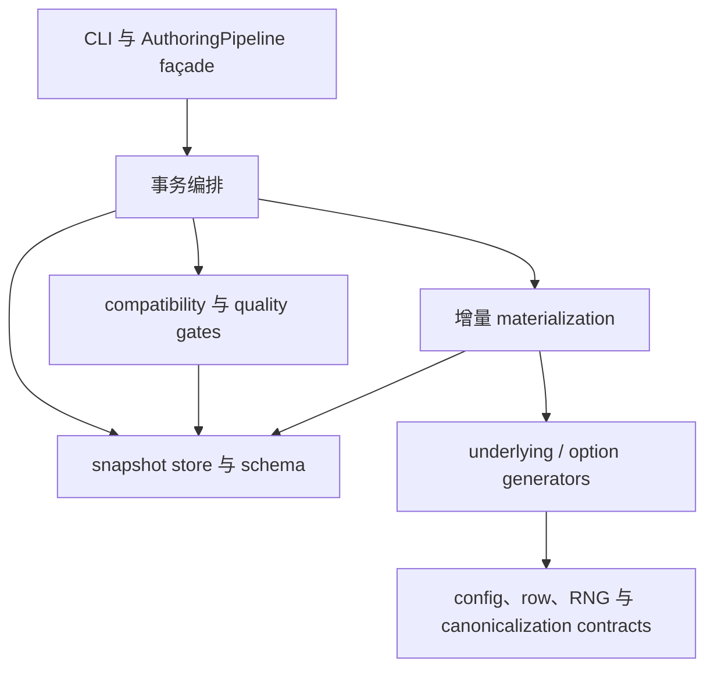

# `raw-fin-data-generation` Authoring Pipeline 重构计划

> 仓库：`ruihuabunny/FinMaths-synthetic-data-demo`
>
> 分支：`raw-fin-data-generation`
>
> 审计基线：[`0d247a1`](https://github.com/ruihuabunny/FinMaths-synthetic-data-demo/commit/0d247a173643f76df02be0e81a840f36e7c781da)（2026-08-19）
>
> 审计范围：`src/synthetic_derivatives/authoring/`、相关 authoring tests 与当前架构文档
> 文档状态：待实施、非规范性计划；当前行为仍以代码、配置、DuckDB schema、测试和冻结 artifact 为准。

> **当前实施状态（2026-08-19）**：Phase 0–6 已完成。稳定 façade、closed config
> version policy、typed row contracts、schema/storage/pipeline components 与 underlying
> generation components 已落地；验收入口见
> [`src/synthetic_derivatives/authoring/README.md`](../../src/synthetic_derivatives/authoring/README.md)、
> [`tests/unit/test_authoring_row_contracts.py`](../../tests/unit/test_authoring_row_contracts.py)、
> [`tests/unit/test_config_version_policy.py`](../../tests/unit/test_config_version_policy.py) 和
> [`tests/integration/test_authoring_transaction_semantics.py`](../../tests/integration/test_authoring_transaction_semantics.py)。
> 本文其余内容保留为实施时的历史方案与决策记录。

## 1. 结论

可以，而且现在已经到了值得重构的阶段。

不过重构理由不只是“文件接近 1000 行”，而是两个核心模块已经同时承担多个变化原因：

- `config.py` 同时拥有领域 dataclass、确定性函数数学、1.0–1.8 版本能力判断、各 section parser、跨 section 校验、option-chain 构建和相关矩阵派生；
- `pipeline.py` 同时拥有 DuckDB 连接生命周期、事务编排、增量 path materialization、immutable compatibility、quality gates、revision/run audit、summary 和 manifest 发布。

建议优先拆 `config.py` 与 `pipeline.py`，然后拆 `underlying_daily_generator.py`；`schema.py` 虽然长，但大量内容是声明式 DDL，应只隔离“DDL / migration / table contract / persistence primitive”，不要为了压行数把每张表拆成一个文件。

这轮应是纯结构重构：不改变数学、随机流、config/schema identity、逻辑行、事务语义或公开接口，也不重新生成任何 accepted delivery。

## 2. 当前基线与证据

| 文件 | 当前规模 | 主要高复杂度单元 | 判断 | 优先级 |
|---|---:|---|---|---:|
| `config.py` | 1,776 行 | `load_generator_config` 297 行；dependence parser 198 行；option-chain parser 131 行 | 版本判断、领域合同与数学派生高度集中 | P0 |
| `pipeline.py` | 1,282 行 | `_generate_incremental_rows` 211 行；quality gates 129 行；`sync_range` 88 行 | 单一 class 跨越编排、DB、校验和发布 | P0 |
| `schema.py` | 854 行 | DDL 约占前半；`initialize_schema` 164 行 | 文件长，但声明式内容多；migration 与 runtime persistence 值得隔离 | P1 |
| `underlying_daily_generator.py` | 681 行 | metadata row 202 行；daily row 110 行；bridge 76 行 | P-path、OHLCV observation、provenance serialization 混合 | P1 |
| `option_daily_generator.py` | 348 行 | option quote 104 行 | 仍围绕单一 option-generation 职责，可暂缓 | P2 |
| `generator_common.py` | 226 行 | keyed lognormal 49 行 | 规模可接受；只需移出 neutral canonicalization | P2 |
| `backends.py` / `cli.py` | 137 / 96 行 | 无明显巨石单元 | 边界清楚，保留 | 不拆 |

当前实现并不是“完全没分层”：旧单体 generator 已经拆成 underlying/option generators，且 model-family backend registry 已经落地。因此本计划不撤销现有边界，也不借机预先设计 Heston/local-vol 的 generic kernel。

### 2.1 具体耦合点

1. `config.py` 多次直接比较版本字符串集合。新增一个版本时，loader、liquidity、quote noise、Q pricing、dependence、RNG、observation contract 等多个位置都需要同步修改。
2. generator 输出依赖按 `TABLE_SPECS` 顺序拼接的裸 tuple；pipeline 通过 `row[6]`、`contract[1]`、`contract[2]` 等位置读取业务字段。列顺序变化可能静默改变语义。
3. `AuthoringPipeline` 既决定事务边界，又直接执行大量 SQL，还负责生成 rows、immutable preflight、post-write gates、revision 和文件发布。
4. compatibility checks 在写前和 quality gates 中再次执行是有意的：写前防止污染已有 snapshot，写后验证新插入 contract。重构时必须显式保留这两个阶段，不能把它们误判成重复逻辑删掉。
5. `UnderlyingDailyGenerator` 同时修改 QuantLib evaluation date、生成 P-close、构造 legacy/bridge OHLC、生成 volume、拼装 P/Q metadata JSON 和数据库 row。
6. `schema.py` 把当前 DDL、solver-visible view、2.0–2.6 migration、table column order、MERGE primitive 和 privacy helper 放在同一模块。

## 3. 重构目标

### 3.1 必须达到

- `AuthoringPipeline` 只保留公开 façade 与事务顺序；具体工作委托给明确组件。
- config 版本能力只在一个 closed policy table 中定义，现有 1.0.0–1.8.0 行为逐版本保持。
- 用具名、tuple-compatible 的 row contracts 代替业务代码中的位置索引。
- 数学生成与 DuckDB persistence 不互相导入。
- immutable preflight、post-write quality gates、revision、FAILED run、NOOP 和 manifest-after-commit 语义保持不变。
- `AuthoringPipeline`、`load_generator_config`、`TABLE_SPECS`、`initialize_schema`、`merge_rows` 及现有 generator import path 保持兼容。
- 所有 deterministic logical rows 在重构前后 exact equal；禁止用 tolerance 掩盖差异。

### 3.2 明确非目标

- 不新增 model family、pricing model、pricing engine 或 task capability。
- 不改变 P/Q measure、numeraire、day count、state、units 或 BSM 数值方法。
- 不升级 generator config version、DuckDB schema version、snapshot identity 或 RNG identity。
- 不改变 Brownian bridge、integrated variance、keyed lognormal volume、round-half-even 或 stream-key 顺序。
- 不并行化 QuantLib generation；`ql.Settings.instance().evaluationDate` 是进程级状态，需另行设计才能安全并发。
- 不把 Solver/Verifier 数值实现抽进 authoring common module。
- 不迁移或改写 FROZEN snapshots，不重建 accepted source package / delivery。
- 不把本轮变成“大目录重写”；每个 phase 必须独立可合并、可回滚。

## 4. 目标依赖方向



依赖规则：

- 只有 pipeline façade 决定 `BEGIN / COMMIT / ROLLBACK` 顺序；不要把完整事务隐藏进通用 repository abstraction。
- materializer 可以调用 backend generators 和 snapshot store，但不写 manifest。
- generators 不导入 DuckDB、schema migration、task、solver 或 verifier。
- storage 层不导入 QuantLib 或金融模型实现。
- validators 可以读取 snapshot 并调用 authoring generator 做 exact replay，但不得导入 Solver 数值实现。
- manifest 只在 DB commit 成功后原子发布。

## 5. 建议文件布局

保留现有公开模块作为 façade，再逐步抽取内部模块，避免一次性修改所有 import：

```text
src/synthetic_derivatives/authoring/
├── __init__.py                         # 保留现有公开 exports
├── backends.py                         # 保留显式 tdgbm_bsm dispatch
├── cli.py                              # 保留薄 CLI
│
├── config.py                           # 兼容 façade：re-export + load entrypoint
├── config_models.py                    # GeneratorConfig/UnderlyingConfig 等 immutable types
├── config_versions.py                  # 1.0.0–1.8.0 closed capability policy
├── config_loader.py                    # JSON I/O、top-level parse orchestration
├── deterministic_functions.py          # piecewise-linear 数学与 parser
├── dependence.py                       # Lambda -> D/R、P/Q mapping validation
├── option_chain.py                     # chain contracts、builder、strike collision validation
├── observation_contracts.py            # bridge/volume contract parsing
│
├── canonicalization.py                 # Decimal、canonical JSON、price quantization
├── row_contracts.py                    # tuple-compatible NamedTuple rows
├── generator_common.py                 # pinned QuantLib、calendar/day-count、keyed RNG
├── underlying_daily_generator.py       # 保留 façade 与 row assembly
├── underlying_observations.py          # legacy range、Brownian bridge、volume
├── pricing_metadata.py                 # P/Q metadata payload builder
├── option_daily_generator.py           # 暂保留；后续仅在出现第二 quote engine 时再拆
│
├── pipeline.py                         # 公开 façade + transaction orchestration
├── materialization.py                  # IncrementalMaterializer
├── snapshot_store.py                   # authoring DB reads/writes、runs/revisions/counts
├── compatibility.py                    # immutable snapshot/config preflight
├── quality_gates.py                    # post-write completeness/replay/privacy gates
├── manifest.py                         # atomic manifest publication
│
├── schema.py                           # 兼容 façade
├── schema_ddl.py                       # current tables/views DDL
├── schema_migrations.py                # explicit 2.x -> 2.6 migration steps
├── table_specs.py                      # TableSpec/TABLE_SPECS
└── persistence.py                      # merge_rows primitive
```

这是一张终态图，不要求一个 PR 创建全部文件。若某次抽取只能得到几十行且没有独立变化原因，应留在相邻模块，避免把巨石文件变成“碎石文件夹”。

## 6. 模块级拆分方案

### 6.1 `config.py`

建议保留 `config.py` 作为兼容 façade，继续支持现有：

```python
from synthetic_derivatives.authoring.config import (
    GeneratorConfig,
    UnderlyingConfig,
    OptionChainBuilder,
    load_generator_config,
)
```

内部抽取映射：

| 当前内容 | 目标模块 |
|---|---|
| `quantize_to_increment` | `canonicalization.py` |
| `DeterministicFunction*` 及 interval integration | `deterministic_functions.py` |
| config dataclasses | `config_models.py`，或由所属领域模块定义后在 façade re-export |
| `OptionChainBuilder`、chain parser、strike collision check、`option_id` | `option_chain.py` |
| dependence dataclass、Lambda/D/R derivation、P/Q covariance mapping | `dependence.py` |
| bridge/volume config parsers | `observation_contracts.py` |
| top-level assembly 与文件读取 | `config_loader.py` |

`config_versions.py` 应声明现有版本的显式 capability，而不是散落的 `schema_version in {...}`：

```python
@dataclass(frozen=True)
class ConfigVersionPolicy:
    option_input: Literal["templates", "chain"]
    require_liquidity_and_noise: bool
    pricing_contract: Literal["legacy_smile", "common_q"]
    dependence_contract: Literal["none", "p_only", "p_q"]
    observation_contract: Literal["legacy", "bridge_volume"]
    expected_rng: str
```

policy table 只登记 1.0.0–1.8.0；未知版本仍 fail closed。不要把它设计成允许任意 future flags 的通用 capability graph。

同时新增内部纯函数 `parse_generator_config(raw: Mapping[str, Any])`，`load_generator_config(path)` 只负责 JSON I/O。这样 parser 测试不再必须创建临时文件，但外部 API 不变。

### 6.2 Row contracts 与 `TABLE_SPECS`

先引入 `typing.NamedTuple`，因为它既提供字段名，也保持 DuckDB `executemany` 所需的 tuple 行为和原有列顺序：

```python
class UnderlyingDailyRow(NamedTuple):
    snapshot_id: str
    date: date
    underlying_id: str
    spot_open: Decimal
    spot_high: Decimal
    spot_low: Decimal
    spot_close: Decimal
    adjusted_close: Decimal
    volume: int
    dividend: Decimal
    corporate_action: str
    generated_run_id: str
```

pipeline 由 `row[6]` 改为 `row.spot_close`，由 `contract[2]` 改为 `contract.underlying_id`。每种 row 增加一条 contract test：

```python
assert UnderlyingDailyRow._fields == TABLE_SPECS["underlying_daily"].columns
```

这一步不得自动根据 dataclass 反射生成 DDL，也不得改变列序；row type 与 storage contract 仍是显式、可审计的双边合同。

### 6.3 `pipeline.py`

`AuthoringPipeline` 继续拥有：

- backend resolution；
- connection 生命周期；
- public methods：`create_smoke_snapshot`、`append_business_days`、`sync_config`、`sync_range`、`freeze`、`validate`、`summary`；
- `sync_range` 的完整事务顺序。

其余职责抽取如下：

| 当前方法/职责 | 目标组件 |
|---|---|
| `_generate_incremental_rows` | `IncrementalMaterializer.materialize(...)` |
| `_assert_*_is_compatible`、snapshot identity/editability | `SnapshotCompatibilityValidator` + store 查询 |
| `_assert_quality_gates`、replay、privacy、common-Q | `SnapshotQualityGates` |
| `_relation_exists`、查询现有 path/quotes、counts | `SnapshotStore` |
| `_record_revision`、`_record_failed_run`、run status | `SnapshotStore` |
| `_write_manifest` | `manifest.write_snapshot_manifest(...)` |

重构后的 `sync_range` 仍应清楚呈现以下顺序：

```text
reject legacy writable identity
  -> resolve business dates
  -> BEGIN
  -> immutable preflight
  -> insert RUNNING audit row
  -> materialize masters/specs/P paths/metadata/Q quotes
  -> post-write quality gates
  -> create revision only when inserted_count > 0
  -> complete run as COMPLETED or NOOP
  -> COMMIT
  -> publish manifest atomically
```

失败规则保持：

- immutable/frozen preflight failure：rollback，且不创建 FAILED audit row；
- RUNNING row 创建后失败：market transaction 全部 rollback，再单独记录一条 FAILED run；
- manifest failure 不得伪装成 DB rollback；DB 已提交这一事实必须在异常中可见。

为了兼容现有 tests，可继续暴露 `pipeline.connection`；内部 store 复用该 connection，不另开写连接。

### 6.4 `schema.py`

`schema.py` 继续 re-export：

- `SCHEMA_VERSION`
- `TABLE_SPECS`
- `initialize_schema`
- `merge_rows`
- 当前 privacy helpers（直到调用方迁移完成）

拆分重点：

- `schema_ddl.py`：当前 2.6 tables/views；长 SQL 可以保留为一到数个清晰常量；
- `schema_migrations.py`：冻结检查、legacy dependence table rebuild、additive columns、schema-version update；
- `table_specs.py`：列序与 business keys；
- `persistence.py`：temporary staging + `MERGE INTO`；
- privacy projection/check 可放 `quality_gates.py` 或独立 `visibility.py`，但不能进入 solver。

每个 migration step 应有明确的 source/target version 和不变量。不要把 2.0–2.5 的差异继续折叠成一个越来越长的 `if current_version != ...`。

### 6.5 `underlying_daily_generator.py`

建议第二阶段再拆，避免与 pipeline/config 同时大改：

- `underlying_path.py`：interval parameters、P-measure close transition、factor + idiosyncratic shock；
- `underlying_observations.py`：legacy synthetic range、integrated-variance Brownian bridge、legacy/keyed volume；
- `pricing_metadata.py`：P/Q provenance payload 与 canonical JSON；
- `underlying_daily_generator.py`：保持 backend 所需 façade，组合以上组件并返回 typed rows。

必须原样保留：

- published quantized close 是下一期 restart state；
- start date 不抽虚构 transition；
- calendar interval 使用精确 drift integral 与 variance RMS；
- close dependence 只消费 P spec；
- bridge 给定 endpoints 后是 per-underlying marginal；
- bridge step key、volume key、close factor/idiosyncratic key 的参数及顺序；
- 每个 interior bridge price 先按 underlying tick `ROUND_HALF_EVEN`，再取 discrete extrema；
- metadata 中 private/public 字段边界。

`option_daily_generator.py` 暂不拆。`OptionChainBuilder` 从 config 移出后，该文件已经较集中；只有出现第二个实际 quote/pricing engine，或 option quote method 再次显著膨胀时，才抽 `bsm_quote_engine.py`。

## 7. 分阶段实施计划

### Phase 0：建立重构前 characterization baseline

只加测试和审计 helper，不移动生产代码。

新增建议：

- `tests/unit/test_authoring_row_contracts.py`
- `tests/unit/test_config_version_policy.py`
- `tests/integration/test_authoring_transaction_semantics.py`
- 在现有 public tests 中增加 logical snapshot fingerprint helper

Golden comparison 应按所有业务主键排序，并排除 UUID run lineage 与 wall-clock timestamps；其余字段 exact compare。不要比较 DuckDB 文件 bytes，因为物理布局不是 authoring logical contract。

覆盖至少：

- 每个受支持 config version 的 parse success/rejection matrix；
- checked-in configs 的 parsed object fingerprint；
- fixed semantic keys 的 Gaussian/uniform draws；
- one-shot vs append logical rows；
- bridge price grid、OHLC extrema、volume exact value；
- frozen/preflight/FAILED/NOOP/revision/manifest 时序；
- schema 2.0–2.5 migration 到 2.6 的 logical preservation；
- solver-visible privacy 与 P/Q boundary。

### Phase 1：抽 neutral contracts

1. 新建 `canonicalization.py`，移动 Decimal/canonical JSON helpers，并从旧模块 re-export。
2. 新建 `row_contracts.py`，generator 改为返回 NamedTuple rows。
3. 消除 pipeline 中所有业务 tuple index；DB fetch 结果在 store 边界立即转换为具名 record。
4. 保持 `TABLE_SPECS` 列序和 `merge_rows` 输入完全不变。

此 phase 不改 config version logic、pipeline 事务或 generator 数学。

### Phase 2：拆 `config.py`

1. 先移动 pure value types/math，并在 `config.py` re-export。
2. 引入 closed `ConfigVersionPolicy` table，把散落的版本集合判断逐段替换。
3. 依次抽 option chain、dependence、observation parsers；每移动一个 section 就运行对应 unit tests。
4. 最后把 top-level loader 缩成 I/O wrapper + parse orchestration。

推荐单独 PR；不要同时修改 pipeline。

### Phase 3：拆 schema/storage

1. 抽 `TABLE_SPECS` 与 `merge_rows`，保留 façade imports。
2. 抽 current DDL。
3. 把 migration 拆成显式步骤，并用现有 2.0/2.4/2.5 fixtures 验证。
4. 建立 `SnapshotStore`，先只包装现有 SQL，不改变 query 或 transaction ownership。

### Phase 4：拆 `pipeline.py`

1. 先抽 manifest；这是 transaction 外的独立副作用。
2. 再抽 run/revision/count/summary persistence。
3. 抽 immutable preflight validator。
4. 抽 post-write quality gates，保留 pre/post 两次合同检查。
5. 最后移动 incremental materialization。

每一步完成后，`AuthoringPipeline` 的 public method 签名与返回 dict 保持不变。

### Phase 5：拆 underlying generation

1. 先抽 metadata builder，因为它是 serialization concern，且不改变 path law。
2. 再抽 bridge/volume observation。
3. 最后抽 P-close transition/dependence shock。
4. 以 exact replay、append invariance 和 fixed-key draws 验收。

### Phase 6：清理与文档

- 更新 `src/synthetic_derivatives/authoring/README.md` 的模块职责表和生成顺序；
- 新增/更新最近层级 `AGENTS.md`，明确 façade、storage、generation、validation 的依赖限制；
- 更新 `docs/authoring_pipeline.md`，但不复制数学合同，链接到 owning module/contract；
- 在 `docs/plans/README.md` 登记本计划为 pending，完成后只更新状态，不改写历史；
- 删除迁移期 re-export 只能另开 deprecation phase，本轮默认永久保留兼容 façade。

## 8. 回归测试矩阵

| 合同 | 必须验证的结果 |
|---|---|
| Config | 1.0.0–1.8.0 接受/拒绝集合、exception type 与已测试 message 不变 |
| RNG | SHA-256 seed material、argument order、QuantLib RNG 和 fixed draws exact equal |
| P-path | start condition、calendar interval、rounded restart、Lambda/D/R shocks exact equal |
| OHLCV | legacy range、bridge endpoints/grid/extrema、keyed volume exact equal |
| Option | frozen strike/ID/expiry、Q volatility、BSM mid、spread noise、activity exact equal |
| Incremental | one-shot = append；historical gap 仍拒绝；additive entity backfill 不扩大 |
| Transaction | preflight 无 audit mutation；started-run failure 有一条 FAILED；无 partial market rows |
| Snapshot | COMPLETED/NOOP、revision、freeze、summary 与 manifest 字段不变 |
| Migration | mutable 2.0–2.5 logical rows不变；FROZEN DB 不原地迁移 |
| Visibility | solver-visible views、private-field leakage gate、P/Q pair exposure 不变 |
| Imports | authoring 不导入 solver/verifier；现有 public import paths 可用 |
| Artifacts | checked-in snapshots 和 accepted deliveries 无 diff、无 regeneration |

建议每个 phase 的最小验证：

```bash
.venv/bin/python -m pytest \
  tests/unit/test_authoring_config.py \
  tests/unit/test_option_chain_builder.py \
  tests/unit/test_underlying_simulator.py \
  tests/unit/test_authoring_backend_registry.py

.venv/bin/python -m pytest \
  tests/public/test_authoring_smoke.py \
  tests/public/test_authoring_template.py \
  tests/integration/test_task_authoring_boundary.py

.venv/bin/python -m pytest
git diff --check
```

所有 snapshot generation 必须写入临时目录；不得用测试重写 checked-in frozen snapshot 或 `task_packages/deliveries/`。

## 9. 风险与规避

| 风险 | 规避措施 |
|---|---|
| version policy 抽取后错误合并相邻版本语义 | 为每个 1.x 版本建立 capability matrix 和 negative tests，不用数值大小推断能力 |
| NamedTuple 字段与 DuckDB 列错位 | `_fields == TABLE_SPECS.columns` contract test；禁止反射生成 DDL |
| repository abstraction 偷偷改变 transaction | `BEGIN/COMMIT/ROLLBACK` 仍留在 pipeline；failure-injection tests |
| preflight/post-write gate 被误删一次 | 分别命名 `preflight_existing_snapshot` 与 `validate_materialized_snapshot` |
| RNG helper 移动导致 key 改序 | fixed semantic-key golden draws；保留字符串、类型转换和 hash slicing |
| QuantLib global evaluation date 引入并发差异 | 本轮保持串行，不添加线程/async generation |
| migration 重建表改变 logical row | 对迁移前后按完整 logical columns exact compare |
| 为未来 family 过度抽象 | 只抽当前真实职责；保留 `tdgbm_bsm` backend 与 BSM-specific generator |
| façade re-export 形成循环 import | 先定义依赖方向；内部模块不从 façade 回导，只有外部调用者使用 façade |
| 重构顺便“优化”数学或 schema | 数学/合同变化必须另开 versioned proposal 和 PR，不混入 refactor |

## 10. Definition of Done

- [ ] `config.py` 成为稳定 façade，版本能力集中在一个 closed policy table；
- [ ] `pipeline.py` 只保留 lifecycle、public API 和清晰事务顺序；
- [ ] pipeline/materializer 不再出现用于业务语义的裸 tuple 数字索引；
- [ ] DDL、migration、table specs、MERGE primitive 各有单一变化原因；
- [ ] underlying path、observation 与 metadata serialization 可独立测试；
- [ ] 现有 public imports、CLI commands 与返回 payload 不变；
- [ ] config 1.0–1.8、schema 2.0–2.6 与 legacy read-only 行为不变；
- [ ] one-shot/append、P/Q、Brownian bridge、volume、option quote 与 manifest logical outputs exact equal；
- [ ] preflight、rollback、FAILED、NOOP、revision、freeze 事务语义通过专项测试；
- [ ] full pytest 与 `git diff --check` 通过；
- [ ] accepted artifacts、checked-in snapshots 和 deliveries 无变更；
- [ ] README/AGENTS/docs 与新职责边界一致。

## 11. 最终建议

最稳妥的顺序是：先冻结行为，再引入具名 row contract，然后拆 config，之后拆 storage/pipeline，最后拆 underlying generator。

不要直接把 1,282 行的 `AuthoringPipeline` 按函数复制到几个文件；先建立 `row contracts + SnapshotStore` 两条接缝，后续抽取才会有稳定边界。也不要先重写 `GeneratorConfig` 的数据形状：当前 flat dataclass 是多个模块的兼容接口，本轮只移动定义并集中版本能力，未来真正出现第二个 authoring family 时再设计 family-specific config。

按这个方案实施后，重构会降低维护成本，同时保留当前最重要的资产：可重放的 P-path、独立的 Q-pricing、严格的 private/public boundary、exact canonical output，以及已经冻结的 task/package identity。
