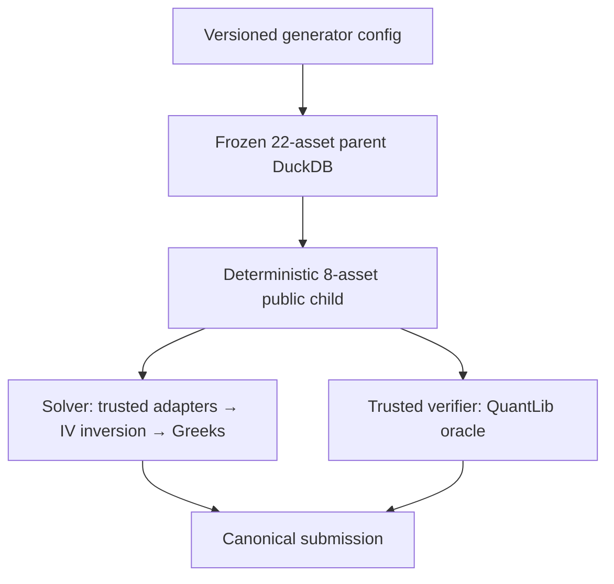

# Synthetic BSM Multi-Asset Option Chain + PSD Correlation + DuckDB + Greeks 实施计划

- Repository: `ruihuabunny/FinMaths-synthetic-data-demo`
- Target branch: `synthetic-BSM-agent-task`
- F2A audit branches: `f2a-arbitrage-task` → `f2a-2nd-revised` → `f2a-arbitrage-revised`
- Design source: `docs/financial_derivatives_deterministic_orm_framework_mutation_curriculum_simulator_final.md`
- Audit date: 2026-08-12
- Status: Phase 0–7 与单条 golden packaging Phase A–E 已完成；task 已 `ACCEPTED`；Phase F batch runner/dataset exporter 已实现。旧 interface 有本地历史 batch，当前最小 prompt/interface 的 batch rebuild 与 `RELEASED` promotion 尚未执行

> 第 2 节保留迁移前审计结果，便于解释差异来源；本文其他章节已按实际落地结果回填。
> 逐项证据与唯一未完成的 commit checkpoint 以
> `docs/plans/synthetic_bsm_multi_asset_psd_duckdb_greeks_codex_checklist.md` 为准。

## 1. Executive decision

该 vertical slice 已在 `synthetic-BSM-agent-task` 完成。本次没有把 F2A 整条分支合回，
而是只迁入通用 authoring hardening，并落地以下结果：

1. 保留现有 22-underlying、65-business-day、static option-chain parent；
2. 已把 F2A 中通用的 config `1.6.0`、minimum price increment、IV/task boundary 与隐私投影迁入目标分支；
3. 在现有 `P`-measure PSD factor dependence 之外增加了有独立 identity 的 `Q`-measure dependence spec；
4. 从临时 materialized、frozen 的 `1.7.0` parent 确定性抽 8 个 underlying，生成 public-only task DuckDB；
5. 主任务 **market-implied BSM Greeks** 从 solver-visible bid/ask midpoint 进行固定 80 步 BS inversion，再计算 Delta/Gamma/Vega/Theta/Rho；
6. trusted verifier 用 pinned QuantLib 独立复算，canonicalize 后 exact equality，不使用 tolerance；
7. golden task 已按 database、prompt、hidden pytest、reference trajectory 与 runtime capability contract 完整打包。

这条路线延续我们已经确定的原则：**market-implied Greeks 使用 BS inversion，不对 `d1`、`d2` 或 BSM pricing terms 做 regression。**

## 2. 迁移前目标分支状态（历史审计）

| 能力 | 迁移前状态 | 已完成动作 |
|---|---|---|
| Multi-asset underlying universe | 已有 22 个 underlying | 保留 |
| Static option chain | 已有 4 expiries × 7 strikes × call/put；1,232 个固定合约 | 保留，task child 再取子集 |
| Daily option panel | 已有 65 business dates、60,368 条 live quotes | 保留 |
| BSM marginal pricing | 已有 QuantLib `AnalyticEuropeanEngine`，按 valuation-to-expiry integrated variance 定价 | 保留并加强 contract |
| PSD correlation | 已有 `R = ΛΛᵀ + D`，但只声明 `measure=P` | 扩展成 P/Q measure-qualified specs |
| DuckDB snapshot | 已有 schema、incremental authoring、freeze、manifest、replay、SQL views | 保留并新增 task-child materializer |
| Quote tick semantics | 目标分支仍主要依赖 `quote_decimal_places` | 移植 F2A 的 underlying/option separate minimum increments |
| IV boundary | 目标分支 config `1.5.0` 仍会在 authoring 中生成 private IV audit | 移植 `1.6.0`：market generator 不再解 IV |
| Public/private projection | solver-visible pricing metadata 仍可能包含 latent node values | 移植并泛化 F2A 的 projection/leakage gate |
| Greeks task | 尚无 solver、submission schema、task materializer、verifier | 新增 |
| Seven-axis runtime | 文档已是 `(L,P,M,A,D,R,F)`，但 runtime models 仍是六轴 | 升级 runtime，当前任务固定 `F0` |

两个需要明确的数学边界：

- “数据库里有多个 underlying 的 vanilla chains”仍然是逐 instrument 的 `P0` vanilla task，不自动变成 `P8` multi-asset payoff。只有 basket/index/spread/best-of 等联合 payoff 才是 `P8`。
- Cross-asset correlation 不进入单个 vanilla BSM price 或 Greek。它保证联合 underlying market 的 coherence，并为未来 basket/portfolio task 服务；本轮应增加测试确认改变合法 `R` 不改变固定 spot 下的 marginal option price/Greeks。

## 3. 本轮 scope

### 3.1 In scope

- 同一币种 USD；
- 共同 `Q`、money-market numeraire、valuation timestamp 与 flat rate-path identity；
- European、cash-settled vanilla call/put；
- `P` 下 deterministic time-inhomogeneous GBM underlying histories；
- drift-only Girsanov baseline，明确声明 `σ_Q(t)=σ_P(t)`；
- P/Q measure-qualified PSD underlying-driver dependence；
- static multi-asset option chains；
- frozen parent DuckDB 与 public-only child DuckDB；
- analytic BSM price 与 market-IV bisection；
- Delta、Gamma、Vega、Theta、Rho；
- exact-equality pytest hard verifier；
- solver allowlist 与完整 agent trajectory。

### 3.2 Out of scope

- F2A executable-arbitrage、X/U/T signal、mutation localisation、FP/FN calibration；
- `F1+` arbitrage variants；本轮所有 task 均为 `F0`；
- basket/index/spread option pricing；
- smile/surface calibration；
- Heston/CEV/local-vol/jumps；
- American/exotic options；
- stochastic rates、FX、quanto、cross-currency；
- VaR/ES 与 portfolio aggregation；
- 对 `d1`、`d2`、discounted pricing terms 或 Greeks 做 regression。

## 4. Target architecture



Public child 只暴露本题所需数据；parent authoring metadata、latent diffusion node heights、generator seed、private IV/Greek answers 和 verifier manifest 均不得进入 child。

## 5. Joint-market contract

### 5.1 P/Q separation

保留现有 `P` path law：

\[
\frac{dS_{i,t}}{S_{i,t}}
=\mu_i^P(t)dt+\sigma_i^P(t)dW_{i,t}^P.
\]

BSM pricing law 明确为：

\[
\frac{dS_{i,t}}{S_{i,t}}
=(r_t-q_{i,t})dt+\sigma_i^Q(t)dW_{i,t}^Q,
\qquad \sigma_i^Q(t)=\sigma_i^P(t).
\]

`σ_Q=σ_P` 不是默认金融事实，只是当前 `girsanov_drift_only` baseline 的显式 mapping。

### 5.2 PSD factor construction

P 与 Q 都保存独立的 `dependence_spec_id`，但 Q spec 可声明由 P spec 经 drift-only measure change 映射：

\[
D=\operatorname{diag}(1-\lVert\lambda_i\rVert^2),
\qquad R=\Lambda\Lambda^\top+D,
\qquad Z=\Lambda\eta+D^{1/2}\varepsilon.
\]

在连续扩散的 drift-only Girsanov baseline 中，Brownian quadratic covariation 不因等价测度下的 drift shift 改变，因此可以让 P/Q specs 使用相同的 `Λ,D,R` 数值，但必须：

- 使用不同的 measure-qualified IDs；
- 保存 `source_dependence_spec_id` 与 `mapping_id`；
- 固定相同 `driver_order`、dtype、factor order 与 time-grid；
- 明确该结论只适用于当前 drift-only diffusion baseline，不能自动推广到 stochastic-vol/hybrid model；
- 相关矩阵只包含 underlying/model drivers，绝不包含 option IDs、contracts 或 Greeks。

### 5.3 Version proposal

- Generator config: `1.7.0`；`1.6.0` 先承接 F2A 的 IV/task separation 与 tick semantics，`1.7.0` 再增加 Q dependence mapping。
- DuckDB authoring schema: `2.5.0`。
- Public task DB schema: `bsm-greeks-task-duckdb-v1.0.0`。
- Task family: `bsm_market_implied_greeks_v1`。
- Method: `bsm-mid-iv-bisection80-analytic-greeks-v1`。
- Submission contract: `bsm-market-implied-greeks-submission-v1.0.0`。

## 6. Greeks task design

### 6.1 两级 curriculum

| Variant | Coordinates | Inputs | Output | Purpose |
|---|---|---|---|---|
| `bsm_analytic_greeks_v1` | `L1,P0,M0,A0,D1,R1,F0` | 直接给 `S,K,T,r,q,σ,type` | IV input + five Greeks | 公式与 convention 冷启动 |
| `bsm_market_implied_greeks_v1` | `L5,P0,M0,A1,D4,R1,F0` | DuckDB visible bid/ask、spot、contract、curve | market IV + five Greeks | 本轮主交付 |

### 6.2 Public child size

从 22-underlying parent 按 SHA-256 rank + task seed 无放回抽 8 个 underlying。MVP 使用：

- 1 个 valuation date；
- 每个 underlying 取 2 个 live expiries；
- 每个 expiry 取 forward-moneyness 最接近 ATM 的 5 个 strikes；
- call/put 都保留；
- 理论上最多 `8 × 2 × 5 × 2 = 160` rows；
- 只发布通过 IV root、finite Greek 与 canonicalization stability gates 的完整 paired grid；若任一必需 row 失败，则换 task seed/date，不在发布后静默删 row。

### 6.3 Observable price and IV inversion

不使用 hidden latent volatility，也不使用 parent 的 private `option_pricing_audit`。Canonical observed price 为：

```text
observed_price = (Decimal(str(bid)) + Decimal(str(ask))) / 2
```

随后只 cast 一次为 binary64，使用：

- bracket `[1e-6, 5.0]`；
- exactly 80 bisection iterations；
- no early stop；
- no fallback；
- update rule: `price_mid < observed_price` 时更新 lower bound，否则更新 upper bound；
- final root: `(low_80 + high_80) / 2`；
- invalid bracket rows 不进入首个发布 task；
- `d1,d2` 必须从 recovered IV 代入 BSM 公式派生，不作为自由参数。

### 6.4 Greek conventions

设 recovered volatility 为 `σ_IV`，并在每一行 holding `S,K,T,r,q,σ_IV` definition fixed：

- `unit_delta`: spot delta，每一个 option unit，不乘 contract multiplier；
- `unit_gamma`: spot gamma，每一个 option unit；
- `unit_vega_1volpt`: `0.01 × ∂V/∂σ`；
- `unit_theta_1calendar_day`: BSM row-local theta / 365，表示 valuation time 向前一 calendar day，maturity date 固定；它不是 hidden time-varying diffusion curve 的 total derivative；
- `unit_rho_1pct`: `0.01 × ∂V/∂r`，连续复利 flat rate，holding dividend yield fixed；
- contract multiplier 作为 public input 保留，后续 portfolio variant 再做聚合；
- normal CDF/PDF、day count、compounding、sign、scaling、dtype 与 operation order 全部写进 method contract。

Canonical output 使用 8 decimal places、`ROUND_HALF_EVEN`、JSON decimal strings，并按：

```text
valuation_date, underlying_id, expiry, strike, call_put, option_id
```

排序。Verifier 不用 `approx/isclose/allclose`；authoring gate 拒绝靠近最后一位 rounding boundary、跨实现不稳定的 rows。

## 7. DuckDB task contract

### 7.1 Public relations

实际 task child 只创建以下 3 个关系：

```text
metadata.public_task
solver_visible.greeks_task_inputs
solver_visible.greeks_task_contract
```

`greeks_task_inputs` 实际包含：

```text
row_id, task_id, snapshot_id, valuation_date, underlying_id, option_id,
call_put, spot, strike, expiry, time_to_expiry_actual365,
bid, ask, contract_multiplier, currency,
risk_free_rate, dividend_yield, calendar, day_count,
exercise_style, settlement_type
```

`greeks_task_contract` 是一行 `(task_id, method_id, contract_json)`；canonical JSON 包含 IV
method、Greek units、dtype、output precision、row order 与 failure behavior。

### 7.2 Private objects

以下内容只存在于 authoring/verifier side：

- parent `market.*` tables；
- full P/Q dependence provenance；
- latent drift/diffusion node values；
- generator seed 与 sampling/mutation private state；
- QuantLib Greek oracle；
- canonical answer；
- hidden pytest fixtures；
- reference trajectory（若作为训练参考，必须与 solver rollout 输入分离）。

### 7.3 Reproducibility and security

- child 从 parent `ATTACH ... (READ_ONLY)` 后 `CREATE TABLE AS SELECT`，完成后不保留 attachment；
- checksum 对 canonical sorted logical rows 计算，不比较 DuckDB 文件物理 bytes；
- task/sample ID 包含 parent logical checksum、seed、selected underlyings、variant ID；
- child 为新 snapshot identity，parent 永不原地改写；
- production solver 通过 trusted query adapter，只能各查询一次 inputs 与 contract；
- 禁止 raw connection、write SQL、`ATTACH/COPY/INSTALL/LOAD`、extension autoload、network 与 filesystem traversal。

## 8. Solver and verifier independence

Solver 与 verifier 共享 JSON method contract，但不共享数值实现：

- Solver: 标准库 `math/decimal/json/datetime` 自己实现 BSM price、80-step bisection 和 Greeks；
- Trusted verifier: pinned `QuantLib==1.39`，用 QuantLib analytic European pricing/Greek wrapper，在同一固定 bisection schedule 下复算；
- 不把 F2A 中 verifier 与 solver 两份完全相同的 `f2a_stage2.py` 直接复制过来；
- cross-implementation 结果先按同一 8-decimal contract canonicalize，再 exact compare；
- public sanity case 同时校验 call/put、discount/dividend、vega/rho scaling 与 theta sign。

## 9. F2A migration audit

### 9.1 Branch-level conclusion

| Source branch | 内容特征 | 迁移策略 |
|---|---|---|
| `f2a-arbitrage-task` | 最早 6 commits；包含大量通用 authoring hardening、tick semantics、solver allowlist、seven-axis schemas | 主要迁移源 |
| `f2a-2nd-revised` | 后续 4 commits；主要是 F2A v2/v3/v4 mutation、calendar 与 executable-arbitrage | 基本不迁移 |
| `f2a-arbitrage-revised` | 最后 2 commits；增加 v5 model signal、BS inversion、public subset DB、privacy projection | 只抽取通用 primitives |

`f2a-arbitrage-revised` 相对 `synthetic-BSM-agent-task` 领先 12 commits、没有分叉；仍然不建议整条 merge/cherry-pick，因为它同时引入大量 F2A-only schemas、snapshots、oracles 与 semantics。

### 9.2 Port now: 通用改进

以下应以 focused diff 迁移，不覆盖整个文件：

| F2A source | 可迁移内容 | Target action |
|---|---|---|
| `src/synthetic_derivatives/authoring/config.py` | config `1.6.0`、separate underlying/option minimum increments、禁止新 config 放 authoring IV solver | 移植后再加 `1.7.0` Q dependence |
| `src/synthetic_derivatives/authoring/generator_common.py` | `quantize_underlying_price` / `quantize_option_price` | 直接泛化 |
| `src/synthetic_derivatives/authoring/underlying_daily_generator.py` | tick-aligned persisted restart state 与 metadata | 移植；保留 rounded-state law 声明 |
| `src/synthetic_derivatives/authoring/option_daily_generator.py` | separate option tick；停止生成 IV audit rows | 移植 |
| `src/synthetic_derivatives/authoring/pipeline.py` | legacy `1.5` authoring-IV config read-only guard；不再写 IV audit | 移植 |
| `src/synthetic_derivatives/authoring/schema.py` | current authoring 不再把 `option_pricing_audit` 放入 `TABLE_SPECS`；public dynamics projection；private metadata leakage gate | 移植并去掉 F2A wording |
| `tests/unit/test_authoring_config.py` | price increment 与 storage representability tests | 移植，删除 F2A variant coupling assertion |
| `tests/unit/test_option_chain_builder.py` | config `1.6` rejects authoring IV solver | 移植 |
| `tests/unit/test_q_pricing.py` | legacy config read-only、no authoring IV answers、rounded price inputs | 移植 |
| `tests/public/test_snapshot_schema.py` | no legacy IV audit、BSM bounds/parity | 移植并换 snapshot ID |
| `environments/solver/requirements.lock` | allowlist-only `duckdb==1.5.5` boundary | 迁移 |
| `environments/solver/README.md` | dependency/import/API/query-adapter 安全合同 | 去掉 F2A/XUT/arbitrage sections 后迁移 |
| `schemas/difficulty-v2.schema.json` | seven-axis coordinates | 迁移 |
| `schemas/task-v2.schema.json` | registry/variant/compatibility identities | 迁移 |
| `schemas/mutation-v2.schema.json` | seven-axis lineage | 可迁移但本轮不启用 task mutation |
| `schemas/curriculum-v2.schema.json` | stage 0--8 state | 迁移并固定本任务 `F0` |

### 9.3 Extract and refactor: 不可整文件复制

| F2A source | 只抽取什么 | 新的通用位置 |
|---|---|---|
| `src/synthetic_derivatives/verifier/f2a_stage2.py` | `normal_cdf/pdf`、BSM price/bounds、80-step inversion contract/semantics | 独立 solver implementation + QuantLib verifier wrapper |
| `tests/unit/test_f2a_v5_stage2_inversion.py` | round-trip、invalid bracket、fixed method identity、禁止 free `d1/d2`、canonicalization tests | `tests/unit/test_bsm_greeks_inversion.py` |
| `src/synthetic_derivatives/verifier/f2a_database.py` | logical checksum、parameterized deterministic sampler、stable sample ID、subset manifest pattern | `authoring/task_subset.py`；移除 8/22/F2A hard-code |
| `src/synthetic_derivatives/authoring/f2a_child_materializer.py` | frozen parent → new child、atomic manifest 的流程模式 | 只参考 orchestration；不带 mutation scan |
| `scripts/materialize_f2a_agent_tasks.py` | CLI batch materialization pattern | `scripts/materialize_bsm_greeks_tasks.py` |
| `schemas/trajectory.schema.json` | 九字段 trajectory 外壳 | 新建 `trajectory-bsm-greeks-v1.schema.json`，重写 Outcome |
| `configs/task_space/derivatives_v2.json` | F axis 与 generic compatibility rules | 删除 F2A rule，新增 Greeks rules；runtime 也要真的支持 F |
| `configs/curricula/adaptive_v2.json` | stage/mix structure | 去掉 F2A sampling details，加入 two-step Greeks curriculum |
| `snapshots/generated/sql_query/option_chain.sql` | chain query shape | 参数化 snapshot/task IDs |
| `snapshots/generated/sql_query/option_pricing_context.sql` | spot/contract/curve joins | 删除 legacy `quote_iv_source` |
| `snapshots/generated/sql_query/underlying_dependence.sql` | dependence audit query | 扩展成 P/Q rows |

### 9.4 Do not migrate

以下全部留在 F2A：

- `authoring/configs/f2a_dataset_v*.json`；
- `configs/mutations/f2a_*.json`；
- `configs/variants/bsm_arbitrage_finding_f2a_v*.json`；
- `configs/variants/bsm_model_reconstruction_xut_signal_f2a_v5.json`；
- `schemas/f2a-lineage*.json`；
- `schemas/submission-v2/v3/v4/v5/v5.1.schema.json`；
- `src/synthetic_derivatives/authoring/f2a_calibration.py`；
- `src/synthetic_derivatives/authoring/f2a_v5.py`；
- `src/synthetic_derivatives/mutation/f2a.py`；
- 全部 `src/synthetic_derivatives/solver/f2a*.py`；
- `src/synthetic_derivatives/verifier/f2a_contract.py`、`f2a_oracle.py`、`f2a_model_signal.py`、`f2a_stage1.py`、`f2a_v5.py`；
- `scripts/materialize_f2a.py`、`build_f2a_v5_parent_config.py`；
- F2A parent snapshots、fixtures、audits、calendar/mutation tests；
- X/U/T signals、transaction-cost arbitrage certificate、calendar candidate catalogue、FP/FN calibration；
- 任何旧的 `d1/d2 pricing-term regression` 文档或实现。

## 10. Implementation phases

### Phase 0 — Branch and identity fence（已完成）

1. 确认工作分支严格为 `synthetic-BSM-agent-task`；
2. 记录当前 head SHA；
3. 禁止 merge 整个 F2A branch；
4. 每个经济/数值 contract 改动使用新 config、snapshot、variant 与 output IDs；
5. 先运行目标分支现有 tests，保存 baseline。

### Phase 1 — Port generic F2A hardening（已完成）

按 §9.2 移植 config `1.6.0`、tick semantics、IV/task separation、privacy projection、solver allowlist 与 tests。此阶段不新增 Greeks，也不改 correlation 数学。

Acceptance:

- legacy `1.5.0` snapshot 可读但不能继续写；
- new `1.6.0` authoring 不产生 IV answers；
- underlying/option ticks 各自重放；
- solver-visible metadata 不泄漏 node heights/seed/private answers；
- existing option-chain and replay tests 仍通过。

### Phase 2 — Add P/Q dependence contracts（已完成）

1. 将单个 `UnderlyingSimulationConfig` 泛化为 versioned P/Q specs；
2. 从 declared `Λ` deterministic derive `D,R`，不接受 config 直接注入独立 `R`；
3. schema 允许 `measure IN ('P','Q')`；
4. Q row 保存 source P spec 与 drift-only mapping；
5. 生成 spot history 时只消费 P spec；
6. vanilla option generator 不接收 correlation object；
7. freeze gate 检查 common Q/numeraire/rate-path/driver-order identity。

Acceptance:

- `R` exact symmetric、unit diagonal，且由 factor construction 保证 PSD；
- P/Q specs 有独立 IDs 且 mapping 完整；
- derivative IDs 无法进入 driver order；
- 同一固定 spot/curve/vol input 下切换合法 correlation，marginal BSM price/Greeks 不变；
- 改 `Λ`、driver order 或 mapping 必须创建新 snapshot identity。

### Phase 3 — Freeze a clean parent（已完成）

基于现有 22-underlying / 65-day / 4×7×2 `1.6.0` profile，在 package build 的临时目录
派生 `1.7.0` config 与新 snapshot identity。Underlying 与 option minimum tick 都固定为
`0.01 USD`，persisted rounded close 是下一步 Markov restart state。该 private parent 只作为
构建输入，不进入 checked-in package。

Acceptance:

- exactly 22 underlyings；
- stable option IDs/absolute strikes；
- paired call/put grids；
- common Q/numeraire/rate path；
- P/Q dependence rows；
- BSM discounted bounds、put-call parity、strike monotonicity/convexity sanity checks；
- replay logical checksum identical；
- snapshot status `FROZEN`。

### Phase 4 — Generic public-child materializer（已完成）

新增通用 sampler、logical checksum、subset manifest 与 public-only child writer。不要从 F2A 携带 mutation、arbitrage scan 或 physical-node fitting contracts。

Acceptance:

- same seed → same 8-underlying set、sample ID、row set 与 logical checksum；
- different seed 正常产生新 child identity；
- child 不含 `market`/authoring/private answer tables；
- task row order 与完整 paired grid 固定；
- parent byte/logical content 不变。

### Phase 5 — Solver implementation（已完成）

新增标准库 BSM/IV/Greeks solver，读取两个 public relations，生成 canonical `submission.json`。

Acceptance:

- direct imports 只在 allowlist；
- 无 QuantLib/py_vollib/Scipy/NumPy/Pandas finance shortcut；
- fixed 80-step inversion；
- `d1,d2` 只由 recovered IV 派生；
- call/put rows 与 canonical ordering 完整；
- rerun output byte-identical。

### Phase 6 — Independent QuantLib verifier（已完成）

1. hidden fixture 读取 public child；
2. QuantLib analytic engine 在同一 root schedule 下复算 IV 与 Greeks；
3. canonicalize oracle 与 submission；
4. exact schema/row/value compare；
5. 加最后一位 perturbation、wrong units、wrong row order、wrong theta sign 等 robustness tests。

Acceptance:

- 正确 reference solver all-pass；
- 任一 canonical value 最后一位变化即 fail；
- 改 vega/rho scaling、theta convention、option type、day count 或 row order 均 fail；
- verifier 没有 tolerance 字段或 approximate comparison。

### Phase 7 — Task registry and package（已完成）

1. runtime `TaskCoordinates/Registry/Curriculum` 真正支持 string-valued `F`；
2. 注册两条 Greeks variants；
3. 生成 prompt、public DB、submission schema、pytest、reference trajectory；
4. reference trajectory 保存在 authoring/training side，不进入 solver-visible child；
5. task package manifest 固定 environment allowlist、method IDs 与 file identities。

## 11. Actual repository changes

```text
configs/generators/quantlib_bsm_metals_option_chain_smoke_v2.json
configs/variants/bsm_analytic_greeks_v1.json
configs/variants/bsm_iv_scalar_v1.json
configs/variants/bsm_market_implied_greeks_v1.json
configs/task_packages/bsm_market_implied_greeks_v1.json
configs/task_space/derivatives_v2.json
configs/curricula/adaptive_v2.json
configs/mutations/deterministic_v2.json

schemas/difficulty-v2.schema.json
schemas/task-v2.schema.json
schemas/mutation-v2.schema.json
schemas/curriculum-v2.schema.json
schemas/agent-task-package-v1.schema.json
schemas/agent-task-runtime-contract-v1.schema.json
schemas/agent-task-trajectory-v1.schema.json
schemas/bsm-greeks-submission-v1.schema.json
schemas/bsm-greeks-oracle-config-v1.schema.json

src/synthetic_derivatives/export/{contracts.py,solver_database.py}
src/synthetic_derivatives/packaging_analytic_and_implied_greeks_iv/{bsm_market_greeks_verifier_runtime.py,contracts.py,
  database.py,leakage.py,package.py,parent.py,prompt_renderer.py,reference_solver.py,runtime.py,trajectory.py,views.py}
src/synthetic_derivatives/solver/analytic_and_implied_greeks_iv/{README.md,__init__.py,bsm.py,bsm_implied_volatility.py,bsm_market_greeks.py}
src/synthetic_derivatives/tasks/{bsm_greeks.py,bsm_implied_volatility.py,bsm_market_greeks.py}
src/synthetic_derivatives/verifier/{bsm_greeks.py,bsm_implied_volatility.py,bsm_market_greeks.py}
src/synthetic_derivatives/training/bsm_market_greeks.py

scripts/package_bsm_greeks_task.py
scripts/run_bsm_greeks_batch.py

tests/unit/test_{bsm_solver,bsm_implied_volatility,bsm_greeks_contract,solver_database_export}.py
tests/integration/test_{solver_database_replay,bsm_iv_verifier,bsm_greeks_verifier}.py
tests/packaging_analytic_and_implied_greeks_iv/test_bsm_greeks_{database_and_replay,dataset_export,negative_submissions,
  package_contract,prompt_runtime_drift,release_views}.py
```

Authoring core 采用 focused versioned edits；`1.7.0` parent config 由 packaging builder 从
checked-in `1.6.0` baseline 确定性派生，不额外提交 private parent DB。

## 12. Task package definition of done

当前 source package 包含：

```text
manifest.json
public/
  task.duckdb
  prompt.md
  runtime_contract.json
  submission.schema.json
verifier/
  conftest.py
  test_contract.py
  test_data_identity.py
  test_semantics.py
  oracle_config.json
reference/
  trajectory.jsonl
  final_submission.json
  artifacts/{solver.py,input_digest.json,self_check.json}
authoring_private/
  artifact_manifest.json
  parent_identity.json
  sample_manifest.json
  oracle_answer.json
  build_report.json
  leakage_report.json
views/{authoring,train_dev,evaluation}/
  manifest.json
```

每个 view 目录只保存 allowlisted source-artifact copies，且逐文件 byte identity 已验证。

最终验收：

1. `task.duckdb` 只含 public relations；
2. prompt 与 DB contract、method、units、output schema 完全一致；
3. reference trajectory 能在 solver allowlist 中完成任务；
4. trusted pytest 用 QuantLib 独立复算；
5. 全字段 exact equality；
6. fixed seed 全流程可重放；
7. 任一 private value 泄漏、非法 import、wrong method、wrong unit、wrong row/value 都被拒绝；
8. P/Q dependence 与 marginal BSM semantics 通过数学 gates；
9. 旧 parent 与所有 F2A snapshots 保持不变。

## 13. Execution history and remaining promotion

实施顺序遵循了以下 5 个 review checkpoints：

1. `port generic v1.6 authoring hardening from F2A`；
2. `add measure-qualified P/Q PSD dependence v1.7`；
3. `freeze BSM Greeks parent and public subset materializer`；
4. `add market-IV Greeks solver and independent QuantLib verifier`；
5. `package task, trajectory, allowlist and robustness tests`。

代码与 golden package 已完成，但当前 worktree 没有按这五项形成新的 commit split；checklist
中的 commit checkpoint 因此保持未勾选。Phase F runner 已在前一版 interface 上完成本地
100-task 历史 run；当前最小 prompt/interface 仍需先做有限批次重放，再做完整 rebuild、
数据集与 split 验收，最后由新的明确审批将合格工件从 `ACCEPTED` promote 为 `RELEASED`。
