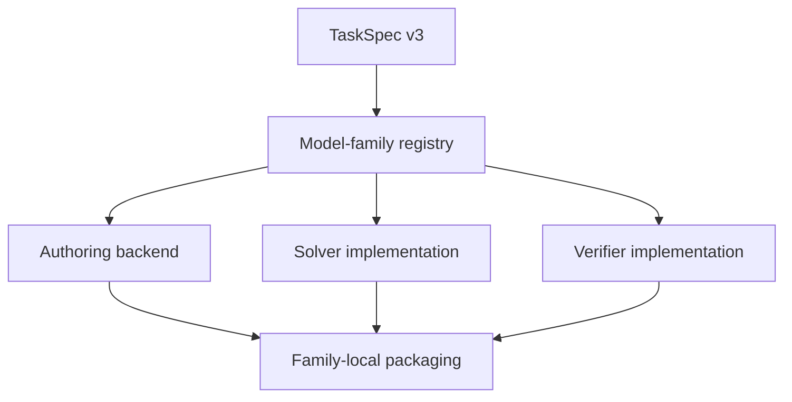

# Synthetic Derivatives Model-Family 重构计划

> 审计对象：`ruihuabunny/FinMaths-synthetic-data-demo`
>
> 分支：`synthetic-BSM-agent-task`
>
> 审计基线：`fab72910`（`preparing for mc greeks`，2026-08-12）
>
> 文档状态：重构设计与实施 handoff；本文件不表示相关代码已经实现。

## 1. 目标

现有仓库已经建立了清楚的权限和信息边界：

- `authoring/` 负责使用可信依赖、私有 seed 和生成 provenance 构造冻结市场；
- `export/` 负责从 frozen authoring parent 导出 public-only solver DB；
- `tasks/` 负责 Solver/Verifier 共享的输入、单位、method identity 与 canonicalization 合同；
- `solver/` 负责受限环境下的独立解题实现；
- `verifier/` 负责独立 trusted oracle 与 hard verification；
- `packaging_*` 负责组装 DB、Prompt、Pytest、Trajectory 和 release views；
- `training/` 负责从 verified packages 导出训练记录。

这些边界应当保留。此次重构的目标不是把整个仓库改成一个顶层 `families/` 目录，而是：

> **在现有权限边界内部增加 model-family 二级路由，并让 curriculum、mutation、packaging 和 runtime capability 都显式依赖 model family。**

最终应满足：

1. 当前 `GBM under P + BSM under Q` 实现被注册为 `gbm_bsm` model family；
2. 新增 Heston、local vol、mixture、shifted BSM、stochastic rates 等 family 时，不修改或破坏已冻结的 BSM package；
3. 不同 family 可以拥有不同的 generator、state、pricing engine、inverse/calibration、Greeks、portfolio 和 hedging 算法；
4. curriculum 在 family 内定义，而不是强迫所有模型共享同一套算法层级；
5. task catalog 与实际 executable runtime 分离，不能把尚未实现的 family 当作可运行能力；
6. 当前 accepted golden package 保持 byte-identical，并继续通过全部 verifier/replay/leakage tests。

## 2. 核心架构决策



采用以下职责划分：

\[
\boxed{
\text{model family 决定数学与实现};\quad
\text{task family/kind 决定能力与输出};\quad
\text{curriculum 只在 family 内排序}
}
\]

七维坐标 `(L,P,M,A,D,R,F)` 继续用于：

- 难度与结构描述；
- mutation lineage；
- compatibility metadata；
- 历史任务迁移；
- rollout diagnostics。

但七维坐标不再单独承担 runtime dispatch。尤其是 `M` 应由 `model_family_id` 派生并校验，不应在 family 内被任意 mutation。

## 3. 当前仓库诊断

### 3.1 Authoring 名义通用，实际固定为 GBM–BSM

当前 [`GeneratorConfig`](../../src/synthetic_derivatives/authoring/config.py) 已包含：

```text
pricing_model
pricing_engine
physical_process
```

但运行实现仍然固定：

- [`UnderlyingDailyGenerator`](../../src/synthetic_derivatives/authoring/underlying_daily_generator.py) 实现 deterministic time-inhomogeneous GBM；
- [`OptionDailyGenerator`](../../src/synthetic_derivatives/authoring/option_daily_generator.py) 直接构造 `BlackScholesMertonProcess` 和 `AnalyticEuropeanEngine`；
- [`AuthoringPipeline`](../../src/synthetic_derivatives/authoring/pipeline.py) 直接实例化这两个 generator。

因此，现有 model/engine 字段主要是 provenance，而不是可靠的 runtime dispatch。仅修改 JSON 中的 `pricing_model` 不能生成 Heston 或 local-vol 市场。

### 3.2 `task_family_id` 混合了不同语义

当前 [`configs/task_space/derivatives_v2.json`](../../configs/task_space/derivatives_v2.json) 同时包含：

```text
bsm_greeks
bsm_vanilla
bsm_multileg
heston_vanilla
local_vol_vanilla
structured_portfolio
model_risk
```

这些名称混合了：

- underlying/pricing model；
- product type；
- target output；
- portfolio workflow；
- model-risk workflow。

因此 `task_family_id` 目前没有稳定的单一职责。

### 3.3 规划中的 task catalog 与可执行能力没有分开

`derivatives_v2.json` 已声明 CEV、mixture、local vol、Heston、jump、rates 和 hybrid 等兼容组合；但当前真正可运行的能力是：

- analytic BSM；
- visible-price BSM IV；
- analytic market-implied BSM Greeks；
- MC 只有 skeleton，尚无 estimator API、draw bank、package 或 verifier。

因此，当前 registry 可以把一个尚无 generator/solver/verifier 的坐标判为结构上 compatible。需要同时维护：

1. **设计 catalog**：描述未来合法的数学 task space；
2. **executable registry**：只声明当前确实可以生成、求解、验证和打包的能力。

### 3.4 Curriculum 无法表达 family-specific 算法

当前 [`AdaptiveCurriculumScheduler.stage_for`](../../src/synthetic_derivatives/curriculum/scheduler.py) 只接收 `TaskCoordinates`，不读取 `task_family_id` 或 model family。

这无法自然表达：

- BSM inverse stage：scalar IV inversion；
- Heston inverse stage：surface calibration of `(kappa, theta, xi, rho, v0)`；
- local-vol inverse stage：IV surface 到 local-vol surface；
- mixture inverse stage：mixture weights/components calibration。

这些任务即使具有相似的抽象目的，也需要不同的算法、输入 schema、optimizer、oracle 和 pytest。

### 3.5 Packaging 同时包含通用生命周期和 BSM 数值语义

当前 [`packaging_analytic_and_implied_greeks_iv/`](../../src/synthetic_derivatives/packaging_analytic_and_implied_greeks_iv/) 同时负责：

- artifact hashes 与 manifest；
- leakage scan；
- runtime contract；
- release views；
- DB selection/materialization；
- BSM 80-step IV inversion contract；
- BSM prompt、reference trajectory 和 QuantLib verifier。

未来若直接复制整个目录到 MC Greeks、VaR/ES、Heston、local vol 等任务，会产生大量基础设施重复。

## 4. 新的任务身份模型

### 4.1 新增三个明确字段

建议在 `TaskSpec v3` 中分离：

```yaml
model_family_id: gbm_bsm
task_family_id: market_implied_greeks
task_kind_id: market_implied_delta
```

含义如下：

| 字段 | 职责 | 示例 |
|---|---|---|
| `model_family_id` | 决定 dynamics、pricing model、measure mapping 和实现 backend | `gbm_bsm` |
| `task_family_id` | 决定能力大类 | `market_implied_greeks` |
| `task_kind_id` | 决定具体目标/输出 | `market_implied_delta` |

完整示例：

```yaml
task_id: gbm-bsm-market-delta-001
model_family_id: gbm_bsm
task_family_id: market_implied_greeks
task_kind_id: market_implied_delta

curriculum:
  local_stage_id: L2

coordinates:
  L: 5
  P: 0
  M: 0
  A: 1
  D: 4
  R: 1
  F: F0

snapshot_id: DERIVATIVES-METALS-LIQUID-BSM-v1
snapshot_revision: 1
method_id: bsm-mid-iv-bisection80-analytic-delta-v1
variant_id: bsm_market_implied_delta_v1
output_contract_id: bsm-market-implied-delta-output-v1
```

### 4.2 不原地修改冻结的 v2 contract

新增：

```text
schemas/task-v3.schema.json
schemas/model-family-v1.schema.json
schemas/executable-capability-v1.schema.json
```

保留：

```text
schemas/task-v2.schema.json
schemas/difficulty-v2.schema.json
```

提供显式迁移函数，而不是静默填充字段：

```text
bsm_greeks + bsm_market_implied_greeks_v1
    -> model_family_id = gbm_bsm
    -> task_family_id = market_implied_greeks
    -> task_kind_id = all_core_greeks
```

当前 accepted golden package 不做原地重写，不改变已有 manifest、hash、task ID 或 package bytes。

## 5. Model-family registry

### 5.1 新增路径

```text
src/synthetic_derivatives/model_families/
├── __init__.py
├── contracts.py
└── registry.py
```

建议的声明对象：

```python
@dataclass(frozen=True)
class ModelFamilySpec:
    model_family_id: str
    physical_dynamics_id: str
    pricing_model_id: str
    measure_mapping_id: str
    model_coordinate: int
    implemented: bool
    supported_task_families: frozenset[str]
    supported_method_ids: frozenset[str]
```

当前只注册：

```python
MODEL_FAMILIES = {
    "gbm_bsm": GBM_BSM_SPEC,
}
```

未来按实现完成情况逐个增加：

```python
MODEL_FAMILIES = {
    "gbm_bsm": GBM_BSM_SPEC,
    "shifted_lognormal_shifted_bsm": SHIFTED_BSM_SPEC,
    "local_vol": LOCAL_VOL_SPEC,
    "mixture": MIXTURE_SPEC,
    "heston": HESTON_SPEC,
    "bates": BATES_SPEC,
    "gbm_hull_white": GBM_HULL_WHITE_SPEC,
    "heston_hull_white": HESTON_HULL_WHITE_SPEC,
}
```

不要在 JSON 中保存任意 Python import path 后动态导入。使用显式 Python registry，便于安全审计、静态搜索和 pytest 覆盖。

### 5.2 设计 catalog 与 executable registry

建议新增：

```text
configs/task_space/
├── derivatives_catalog_v3.json
└── executable_registry_v3.json
```

职责：

| 文件 | 内容 |
|---|---|
| `derivatives_catalog_v3.json` | 所有计划中的合法 model/product/method/output 组合 |
| `executable_registry_v3.json` | 当前已有完整 generator、solver、verifier 和 package tests 的组合 |

当前 executable registry 应只启用：

```json
{
  "enabled_model_families": ["gbm_bsm"]
}
```

并进一步按 task capability 标记：

```json
{
  "gbm_bsm": {
    "enabled_task_kinds": [
      "analytic_greeks",
      "scalar_implied_volatility",
      "market_implied_core_greeks"
    ]
  }
}
```

MC Greeks 只有在 estimator、draw bank、runtime、verifier 和 package E2E tests 全部完成后，才能加入 executable registry。

## 6. 保留权限边界，在边界内部增加 family routing

目标结构：

```text
src/synthetic_derivatives/
├── model_families/
│   ├── contracts.py
│   └── registry.py
│
├── authoring/
│   ├── common/
│   └── families/
│       ├── gbm_bsm/
│       ├── heston/
│       └── local_vol/
│
├── tasks/
│   ├── common/
│   └── families/
│       └── gbm_bsm/
│
├── solver/
│   ├── common/
│   └── families/
│       ├── gbm_bsm/
│       ├── heston/
│       └── local_vol/
│
├── verifier/
│   ├── common/
│   └── families/
│       ├── gbm_bsm/
│       ├── heston/
│       └── local_vol/
│
├── packaging/
│   ├── common/
│   └── families/
│       └── gbm_bsm/
│           ├── market_implied_greeks/
│           ├── mc_greeks/
│           ├── analytic_var_es/
│           └── mc_var_es/
│
└── training/
    ├── common/
    └── families/
        └── gbm_bsm/
```

这是一条渐进目标路径，不要求第一轮 PR 就移动所有文件。优先增加 adapter/registry，待回归稳定后再逐步迁移目录。

### 数值独立性约束

`common/` 只允许共享：

- schema/contract parsing；
- canonical serialization；
- artifact hashes；
- package layout；
- release views；
- leakage checks；
- runtime/capability validation。

不得把 Solver 和 Verifier 的数值实现抽成共同函数。两侧仍必须独立实现 pricing、root finding、Greeks、MC reduction、VaR/ES 或 calibration oracle。

## 7. Authoring 的最小风险重构

### 7.1 第一阶段不移动现有 generator

先增加现有实现的 adapter：

```python
class GBMBSMAuthoringBackend:
    model_family_id = "gbm_bsm"

    def create_underlying_generator(self, config):
        return UnderlyingDailyGenerator(config)

    def create_option_generator(self, config):
        return OptionDailyGenerator(config)
```

把 [`AuthoringPipeline`](../../src/synthetic_derivatives/authoring/pipeline.py) 从直接构造具体类改为：

```python
backend = authoring_family_registry.resolve(config.model_family_id)
underlying_generator = backend.create_underlying_generator(config)
option_generator = backend.create_option_generator(config)
```

该步骤应保证当前 generator 输出逐字节不变。

### 7.2 冻结当前 generator config 1.7

当前 `1.7.0` 清楚表达：

- deterministic time-inhomogeneous GBM under `P`；
- common `Q`/numeraire/rate-path identity；
- drift-only Girsanov mapping；
- same Brownian covariance；
- analytic BSM vanilla pricing。

不要将其原地扩展成能够容纳所有 stochastic-vol/rate models 的巨型 dataclass。

新增 family-aware generator config `2.0.0`：

```yaml
schema_version: 2.0.0
model_family_id: gbm_bsm

physical_model:
  model_id: deterministic_time_inhomogeneous_gbm_p_v1
  parameters: {}

pricing_model:
  model_id: european_bsm_q_v1
  engine_id: quantlib_analytic_european_v1
  parameters: {}

measure_mapping:
  mapping_id: girsanov_drift_only_same_diffusion_v1
```

Heston family 后续可以持久化完整 variance state；local-vol family 可以提供 `sigma_loc(t,S)`；stochastic-rate family 可以持久化 rate state。它们不应被强行塞进当前 `physical_drift_function`/`physical_volatility_function` 数据结构。

## 8. Family-local curriculum

### 8.1 配置结构

冻结现有 `adaptive_v2.json` 为 legacy。新增：

```text
configs/curricula/
├── global_v3.json
└── families/
    ├── gbm_bsm_v1.json
    ├── heston_v1.json
    └── local_vol_v1.json
```

`global_v3.json` 只负责：

- model-family sampling weights；
- family mastery；
- family availability；
- family-level replay/current/explore mixture。

family config 负责本地 stage 与 task selectors。

### 8.2 当前 GBM–BSM curriculum 直接复用现有 L0–L8

[`synthetic_bsm_agent_task_complete_curriculum.md`](../curricula/synthetic_bsm_agent_task_complete_curriculum.md) 已经给出适合当前 pipeline 的依赖顺序：

| Local stage | 能力 |
|---|---|
| L0 | BSM analytic pricing |
| L1 | analytic implied volatility |
| L2 | analytic market-implied Greeks |
| L3 | Monte Carlo pricing and Greeks |
| L4 | `P`-measure diffusion and correlation calibration |
| L5 | delta-normal analytic VaR/ES |
| L6 | underlying portfolio MC VaR/ES |
| L7 | option portfolio full-revaluation MC VaR/ES |
| L8 | research/high-difficulty mutations |

不需要为了全局统一而重新压成六层。

未来 Heston 可以独立定义：

```text
H0 semi-analytic pricing
H1 model-native Greeks
H2 surface calibration
H3 PDE/MC cross-engine comparison
H4 portfolio risk
H5 dynamic hedging
```

local vol 则可以定义：

```text
LV0 pricing from a supplied local-vol surface
LV1 PDE/MC Greeks
LV2 IV surface -> local-vol recovery
LV3 cross-engine validation
LV4 smile/surface portfolio risk
LV5 dynamic hedging under declared smile dynamics
```

### 8.3 Scheduler 两阶段采样

任务概率拆为：

\[
p(\text{task})
=p(\text{model family})
\,p(\text{local stage}\mid\text{family})
\,p(\text{task}\mid\text{family, local stage}).
\]

当前只有：

```json
{
  "family_weights": {
    "gbm_bsm": 1.0
  }
}
```

未来可以扩展为：

```json
{
  "family_weights": {
    "gbm_bsm": 0.55,
    "heston": 0.20,
    "local_vol": 0.15,
    "mixture": 0.10
  }
}
```

将 scheduler API 从：

```python
stage_for(coordinates: TaskCoordinates)
```

升级为：

```python
stage_for(task: TaskSpecV3)
```

它必须同时读取 `model_family_id`、`task_family_id`、`task_kind_id` 与 coordinates。

保留现有 `20/60/20 replay/current/explore` 机制和 binary hard reward；curriculum 只能改变采样权重，不能修改 frozen task 或 verifier reward。

## 9. Mutation 规则

### 9.1 Model family 在普通 mutation 中不可变

当前 `deterministic_v2.json` 允许修改 `M`。新规则应为：

- `model_family_id` immutable；
- `M` 从 model family 派生并校验；
- family-local mutation 可以改变：
  - product/portfolio；
  - pricing engine/method；
  - data interface；
  - requested Greek/risk output；
  - hedging context；
  - reasoning/composition level；
- 修改 `A` 仍必须提供新 `method_id`；
- 修改输出必须提供新 `output_contract_id`；
- 修改 DB/data regime 必须提供新 snapshot identity 或明确 child database lineage。

GBM–BSM family 的 operator 可以允许：

```json
{
  "model_family_id": "gbm_bsm",
  "allowed_axes": ["L", "P", "A", "D", "R"]
}
```

`F` 继续按独立 arbitrage workflow 管理；当前 Greeks/IV/VaR/ES 主线保持 `F0`。

### 9.2 跨模型任务不是普通 mutation

以下应当是独立 authored model-risk families/tasks：

```text
heston_to_bsm
bates_to_local_vol
stochastic_rate_to_deterministic_rate
mixture_to_shifted_bsm
```

它们需要新的真实 DGP、agent model、snapshot identity、method contract、oracle 和 verifier，不能通过把一个 BSM task 的 `M` 从 0 改成 5 得到。

## 10. Packaging 重构

### 10.1 抽取通用 package kernel

建议增加：

```text
src/synthetic_derivatives/packaging/common/
├── artifacts.py
├── leakage.py
├── runtime.py
├── views.py
├── manifest.py
└── package_builder.py
```

只抽取：

- artifact hash 与 private artifact manifest；
- public/reference/verifier/authoring-private 目录布局；
- train/dev、evaluation、authoring release views；
- runtime/capability contract validation；
- leakage scan；
- generic schema validation；
- trajectory JSONL 写入；
- generic package verification lifecycle。

BSM-specific 内容保留在：

```text
src/synthetic_derivatives/packaging/families/gbm_bsm/
└── market_implied_greeks/
    ├── contracts.py
    ├── database.py
    ├── prompt_renderer.py
    ├── reference_solver.py
    ├── trajectory.py
    └── verifier_adapter.py
```

其中包括：

- 80-step fixed bisection；
- visible midpoint IV semantics；
- BSM analytic operation order；
- QuantLib independent oracle；
- BSM-specific input/output rows；
- BSM prompt 与 trajectory。

当前 accepted package 暂不移动。先让新 builder 在测试中重建一个等价临时 package；验证稳定后，再为旧 import path 提供 compatibility re-export。

### 10.2 每个 Greek 使用 output spec 参数化

当前 market-implied package 一次要求：

```text
Delta, Gamma, Vega, Theta, Rho
```

建议增加：

```yaml
output_spec:
  requested_outputs:
    - unit_delta
```

支持独立 task kinds：

```text
market_implied_delta
market_implied_gamma
market_implied_vega
market_implied_theta
market_implied_rho
all_market_implied_core_greeks
```

每条 task package 都必须拥有：

1. 独立 sampling seed；
2. 独立 public DuckDB；
3. 只要求目标字段的 prompt；
4. 严格、无额外字段的 submission schema；
5. 对应的 pytest/verifier contract；
6. 只展示目标推导的 trajectory；
7. 独立 task ID 和 lineage。

Verifier 内部可以复算完整 BSM state，但只能校验该 task 声明的输出字段。不要复制五套 BSM 数值公式。

## 11. Training exporter

当前 [`training/bsm_market_greeks.py`](../../src/synthetic_derivatives/training/bsm_market_greeks.py) 是 BSM-specific nine-field exporter。建议分两层：

```text
training/common/
├── record_schema.py
├── package_reader.py
└── split_lineage.py

training/families/gbm_bsm/
└── market_implied_greeks.py
```

通用层负责：

- 读取 verified package；
- nine-field outer record；
- stable ordering；
- private oracle/seed leakage rejection；
- grouping/split lineage。

family 层负责将 BSM-specific inputs、skills、outcome rows 和 verification evidence 映射到通用记录。

数据划分必须按 latent parent/snapshot/scenario family 分组，避免同一基础市场的不同 Greek 变体跨 train/test 泄漏。

## 12. 推荐的渐进实施顺序

### PR 1：增加 family identity 和 capability registry，不移动实现

新增：

- `src/synthetic_derivatives/model_families/contracts.py`
- `src/synthetic_derivatives/model_families/registry.py`
- `schemas/task-v3.schema.json`
- `schemas/model-family-v1.schema.json`
- `schemas/executable-capability-v1.schema.json`
- `configs/task_space/derivatives_catalog_v3.json`
- `configs/task_space/executable_registry_v3.json`
- v2 → v3 显式 migration adapter。

验收：

- current golden package byte-identical；
- v1/v2 task 继续可解析；
- runtime 只将 `gbm_bsm` 的已实现 task kinds 标为 executable；
- Heston/local-vol catalog entries 不会被 runtime 当作可执行任务；
- `M` 与 `model_family_id` 不一致时拒绝。

### PR 2：Authoring backend dispatch

修改：

- 增加 `GBMBSMAuthoringBackend`；
- `AuthoringPipeline` 通过 registry 创建 generator；
- 保留旧 generator 类与 config 1.7 行为。

验收：

- 固定 config/seed 的 DuckDB logical checksum 不变；
- one-shot、append、`sync-config` 一致性不变；
- P/Q dependence、common-Q、option chain 和 quote-noise gates 不变；
- unknown/unimplemented family fail closed；
- current 1.7 frozen snapshot 不做迁移或改写。

### PR 3：Family-local curriculum 和 mutation guard

新增：

- `configs/curricula/global_v3.json`
- `configs/curricula/families/gbm_bsm_v1.json`
- family-aware scheduler；
- family-local mutation config；
- `M`/family immutability guard。

验收：

- 相同 coordinates 在不同 family 中可以映射到不同 local stage；
- scheduler 不会采样未实现 family；
- 20/60/20 mixture 保留；
- binary verifier reward 不变；
- 普通 mutation 不能跨 model family；
- family/output/method identity 的改变均进入 child task ID 和 lineage。

### PR 4：抽取 generic packaging kernel

抽取：

- hashes/manifests；
- release views；
- leakage；
- runtime；
- package layout；
- generic validation lifecycle。

验收：

- 当前 BSM package tests 全部通过；
- source package 与 release-view copies 的 byte checks 保留；
- solver/verifier 数值实现仍然独立；
- temporary rebuild package 与旧 package 的接口和语义一致；
- runtime attacks、negative submissions 和 leakage tests 不减少。

### PR 5：单 Greek task parameterization

第一批生成：

| Task kind | 实例数 |
|---|---:|
| Market-implied Delta | 3–5 |
| Market-implied Gamma | 3–5 |
| Market-implied Vega | 3–5 |
| Market-implied Theta | 3–5 |
| Market-implied Rho | 3–5 |
| All core Greeks | 3–5 |

合计：

\[
6\times(3\text{–}5)=18\text{–}30
\]

个独立 `DB + Prompt + Pytest + Trajectory` package。

验收：

- 每个实例使用独立 DB 和 selector seed；
- submission schema 只允许目标输出；
- trajectory 与 task kind 对齐；
- verifier 拒绝漏字段、额外字段、错单位、错 method ID 和错行顺序；
- dataset split 按 parent/scenario group，避免同源泄漏。

## 13. 文件级迁移映射

| 当前路径 | 近期处理 | 长期目标 |
|---|---|---|
| `authoring/config.py` | 保留 1.7 parser；增加 v2/family adapter | `authoring/common/` + family configs |
| `authoring/underlying_daily_generator.py` | 原样作为 GBM adapter backend | `authoring/families/gbm_bsm/underlying.py` |
| `authoring/option_daily_generator.py` | 原样作为 BSM adapter backend | `authoring/families/gbm_bsm/options.py` |
| `authoring/pipeline.py` | 改为 registry dispatch | family-neutral orchestrator |
| `task_space/models.py` | 保留 v2；新增 v3 types | family-aware task identity |
| `task_space/registry.py` | 增加 catalog/executable 双层判断 | capability-aware registry |
| `curriculum/scheduler.py` | API 改为接收完整 task | two-stage family/local scheduler |
| `mutation/engine.py` | 增加 family immutability | family-local mutation engine |
| `packaging_analytic_and_implied_greeks_iv/` | 作为 regression baseline | common kernel + `gbm_bsm` package |
| `solver/analytic_and_implied_greeks_iv/` | 暂不移动 | `solver/families/gbm_bsm/` |
| `verifier/bsm_*.py` | 暂不移动，保持独立 oracle | `verifier/families/gbm_bsm/` |
| `training/bsm_market_greeks.py` | 抽 outer record 后保留 adapter | common exporter + family mapper |

## 14. 必须保护的已有行为

重构过程中不得破坏：

1. `P` 与 `Q` 测度明确分离；
2. physical drift 不进入 Q-pricing；
3. current drift-only Girsanov mapping 下 P/Q Brownian covariance 的明确身份；
4. option generator 不直接读取 underlying dependence/path-transition API；
5. frozen absolute strikes、stable contract IDs 和 static listing semantics；
6. quote noise 只作用于 bid/ask half-spread，BSM mid 不变；
7. visible midpoint → exactly 80-step IV inversion → analytic Greeks；
8. 不对 `d1`、`d2` 或 BSM pricing terms 做 regression；
9. Solver/Verifier 数值实现独立；
10. canonical exact comparison，不以 tolerance 替代 hard verifier；
11. fixed method/precision/operation order/rounding/serialization；
12. public-only child DB、recursive leakage gate 和 read-only replay；
13. accepted package 的 hashes、views 和 artifact identity；
14. current F0 Greeks task 不引入 arbitrage business outputs；
15. task/mutation/curriculum 的变更不修改二值 reward。

## 15. 测试计划

### 15.1 新增 unit tests

```text
tests/unit/test_model_family_registry.py
tests/unit/test_executable_registry.py
tests/unit/test_task_v3.py
tests/unit/test_family_curriculum.py
tests/unit/test_family_mutation_guards.py
tests/unit/test_authoring_backend_registry.py
```

覆盖：

- duplicate family IDs；
- unknown/unimplemented family；
- `model_family_id` 与 `M` 不一致；
- catalog compatible 但 runtime unavailable；
- family-local stage mapping；
- cross-family mutation rejection；
- family/method/output identity 纳入 deterministic task ID。

### 15.2 保留并扩展 integration tests

现有以下测试必须继续通过：

- authoring smoke；
- underlying append invariance；
- P/Q joint dependence；
- option-chain stability；
- solver database replay；
- BSM IV verifier；
- BSM Greeks verifier；
- package contract；
- negative submissions；
- runtime drift/attacks；
- release views；
- dataset export；
- leakage checks。

新增：

```text
tests/integration/test_gbm_bsm_backend_equivalence.py
tests/integration/test_catalog_runtime_separation.py
tests/integration/test_task_v2_to_v3_migration.py
tests/integration/test_family_package_dispatch.py
```

### 15.3 Golden regression gate

在 PR 1–4 中，至少固定以下比较：

```text
old GBM-BSM authoring path
    ==
new registry-dispatched GBM-BSM authoring path
```

比较内容包括：

- public logical rows；
- canonical logical checksum；
- selected option IDs；
- task input rows；
- runtime contract digest；
- reference submission；
- verifier outcome；
- release-view bytes。

## 16. 风险与规避

| 风险 | 规避措施 |
|---|---|
| 一次性移动大量模块导致 import 与 pickle/history 断裂 | 先 adapter/registry，后兼容 re-export，再逐步移动 |
| catalog 声称支持尚不存在的模型 | catalog 与 executable registry 分离，runtime fail closed |
| Solver 和 Verifier 因抽 common 而共享数值 oracle | common 仅共享 contracts/packaging infrastructure |
| 新字段改变 accepted task/package identity | 新建 v3 schema，旧 package 不原地迁移 |
| family-local curriculum 破坏现有 replay mixture | 保留 20/60/20，只在 family 选择前增加一层 |
| 单 Greek 参数化被视为同一题裁列 | 独立 DB、seed、prompt、schema、pytest、trajectory 和 task ID |
| 不同 Greek 变体跨 train/test 泄漏 | 按 latent parent/snapshot/scenario family 分组划分 |
| Heston/local-vol 被强行复用 GBM state schema | 每个 family 定义自己的 persisted Markov state contract |

## 17. Definition of Done

完成本轮重构需同时满足：

- [ ] `gbm_bsm` 成为显式 model family；
- [ ] model family、task family 和 task kind 三种身份分离；
- [ ] task catalog 与 executable runtime capability 分离；
- [ ] current generator 通过 backend registry dispatch；
- [ ] current GBM–BSM output/checksum 不变；
- [ ] family-local curriculum 可以复用现有 L0–L8；
- [ ] scheduler 使用完整 task identity，而不只看 coordinates；
- [ ] 普通 mutation 无法跨 model family；
- [ ] generic packaging kernel 不包含数值 oracle；
- [ ] current accepted golden package 保持 byte-identical；
- [ ] 单 Greek package 可以参数化生成；
- [ ] 18–30 条首批独立 package 可重复构建与 hard verify；
- [ ] 全量 pytest 与 `git diff --check` 通过。

## 18. 最终建议

短期只实现 `gbm_bsm` family，不急于创建 Heston/local-vol 的空目录或虚假 API。当前最有价值的重构顺序是：

1. 先稳定 family identity 与 executable registry；
2. 再让 authoring/curriculum/mutation 识别 family；
3. 抽取 packaging 生命周期；
4. 参数化五个单 Greek 与综合 Greeks packages；
5. 完成当前-interface batch rebuild、split audit 和 release；
6. 之后再以完整 backend 的形式新增下一种 model family。

这样既保留当前仓库最重要的可信边界，也能让未来不同 underlying dynamics/pricing model 使用各自的小类算法、solver、verifier 和 pytest，而不需要反复重写已有 BSM pipeline。
